---
panels:
  main:
    label: Слайд
    showNotes: true
  details:
    label: Детали
    # showImages: true
  article:
    label: Статья
    showImages: true
  sources:
    label: Источники
---

### title
*Космологические модели разных культур*
### body
> Космологическая модель — это ответ на вопрос «как устроено пространство мира». Она описывает форму Земли и неба, уровни мироздания, ось мира, границы и движение светил. В этой презентации представлены разные модели без оценки их «правильности».
### notes
*Мы не сравниваем модели с современной наукой и не ранжируем их. Каждая модель интересна своей внутренней логикой и образами.*
### search
cosmology models comparison collage

---

### title
*Месопотамия: плоский диск под твёрдым куполом*
### body
> Земля — плоский диск, окружённый мировым океаном. Небо — твёрдый купол из камня или металла, опирающийся на мировые горы на краях Земли. Светила (Солнце, Луна) — боги, путешествующие по небу днём, а ночью — по подземному миру.
### notes
*Вавилонская карта мира (глиняная табличка VI в. до н.э.) показывает Землю как круг с Вавилоном в центре и «солёной рекой» (океаном) вокруг.*
### search
Babylonian world map circular cuneiform

### article

Космология Месопотамии лучше всего визуализируется как закрытая сфера или полусфера («космическое яйцо»), плавающая в бесконечном мировом океане.
Ниже представлена графическая схема устройства вавилонского и шумерского мира, основанная на древних клинописных текстах и археологических находках (таких как знаменитая Вавилонская карта мира).

## Шесть уровней Вселенной
Согласно вавилонским текстам первого тысячелетия до н.э., Вселенная состояла из шести параллельных плоскостей, расположенных друг над другом (три уровня неба и три уровня земли):

* 🌌 Верхнее небо: Обитель высшего бога Ану, недоступная для других существ. Здесь находился его трон.
* 🪐 Среднее небо: Место пребывания богов Игигов. Здесь на троне из лазурита восседал бог Мардук (в вавилонской традиции).
* ⭐ Нижнее небо: Видимый небосвод, сделанный из яшмы. На нем закреплены звезды, созвездия, Луна и Солнце.
* 🌍 Верхняя земля: Поверхность, на которой живут люди. На ней также находился «пуп земли» — Вавилон с его главным зиккуратом.
* 💧 Средняя земля: Подземный пресноводный океан Абзу (или Апсу). Это владения бога мудрости Энки (Хая), откуда берут начало реки Тигр и Евфрат.
* 💀 Нижняя земля: Подземное царство мертвых (Иркалла или Кур). Сюда уходили души всех умерших, здесь правили богиня Эрешкигаль и бог Нергал.

## Первозданный океан и происхождение мира
В основе месопотамской космогонии лежала идея водного хаоса. До сотворения упорядоченного мира существовали лишь два космических океана:

1. Апсу — олицетворение пресных мужских вод.
2. Тиамат — олицетворение соленых морских вод, воплощавшая первобытный хаос.

Мир возник в результате теомахии (битвы богов), когда молодое поколение богов во главе с Мардуком (или Энлилем в ранних версиях) победило чудовищную Тиамат. Мардук рассек ее тело пополам: из одной половины он создал купол неба, а из другой — твердь земли.
## Механика и законы космоса

* ⚙️ Космос как государство: Вселенная функционировала по принципу абсолютной монархии. У каждого бога была своя четкая обязанность (профессия). Солнце (Шамаш) ежедневно выходило из ворот на востоке, обходило небосвод и уходило в ворота на западе, спускаясь ночью в подземный мир.
* 📜 Скрижали судеб: Движение светил и ход истории определялись «Скрижалями судеб» (Тупшиммати). Тот бог, который владел ими, обладал абсолютной властью над законами природы.
* 🏛️ Зиккураты как космические оси: Ступенчатые башни зиккураты (например, Этеменанки в Вавилоне) служили «аксис мунди» — связующим звеном, соединяющим земной мир, небеса и подземные воды.

### images
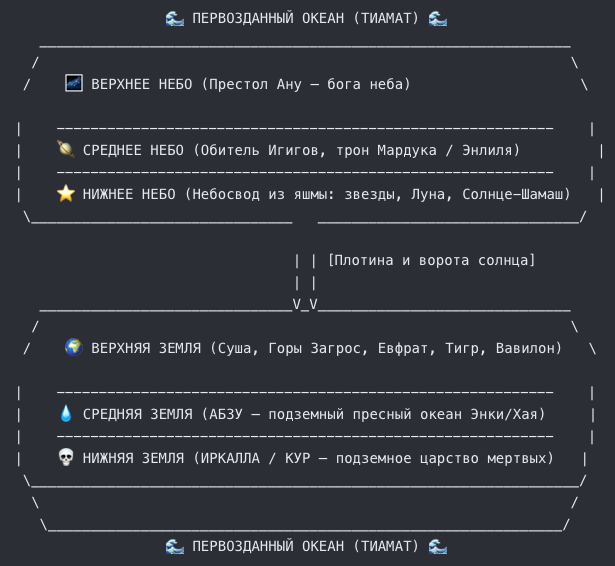
* 🌌 Верхнее небо: Обитель высшего бога Ану, недоступная для других существ. Здесь находился его трон.
* 🪐 Среднее небо: Место пребывания богов Игигов. Здесь на троне из лазурита восседал бог Мардук (в вавилонской традиции).
* ⭐ Нижнее небо: Видимый небосвод, сделанный из яшмы. На нем закреплены звезды, созвездия, Луна и Солнце.
* 🌍 Верхняя земля: Поверхность, на которой живут люди. На ней также находился «пуп земли» — Вавилон с его главным зиккуратом.
* 💧 Средняя земля: Подземный пресноводный океан Абзу (или Апсу). Это владения бога мудрости Энки (Хая), откуда берут начало реки Тигр и Евфрат.
* 💀 Нижняя земля: Подземное царство мертвых (Иркалла или Кур). Сюда уходили души всех умерших, здесь правили богиня Эрешкигаль и бог Нергал.
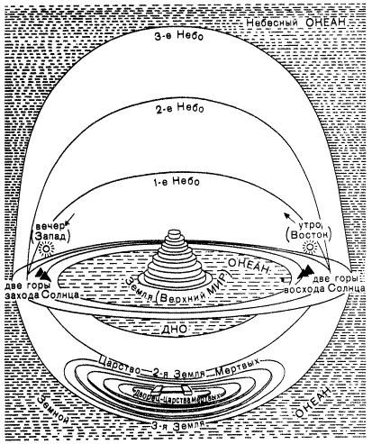
* 🌌 Верхнее небо: Обитель высшего бога Ану, недоступная для других существ. Здесь находился его трон.
* 🪐 Среднее небо: Место пребывания богов Игигов. Здесь на троне из лазурита восседал бог Мардук (в вавилонской традиции).
* ⭐ Нижнее небо: Видимый небосвод, сделанный из яшмы. На нем закреплены звезды, созвездия, Луна и Солнце.
* 🌍 Верхняя земля: Поверхность, на которой живут люди. На ней также находился «пуп земли» — Вавилон с его главным зиккуратом.
* 💧 Средняя земля: Подземный пресноводный океан Абзу (или Апсу). Это владения бога мудрости Энки (Хая), откуда берут начало реки Тигр и Евфрат.
* 💀 Нижняя земля: Подземное царство мертвых (Иркалла или Кур). Сюда уходили души всех умерших, здесь правили богиня Эрешкигаль и бог Нергал.

Вавилонская карта мира (глиняная табличка VI в. до н.э.) показывает Землю как круг с Вавилоном в центре и «солёной рекой» (океаном) вокруг.

Вавилонская карта мира (глиняная табличка VI в. до н.э.) показывает Землю как круг с Вавилоном в центре и «солёной рекой» (океаном) вокруг.

Вавилонская карта мира (глиняная табличка VI в. до н.э.) показывает Землю как круг с Вавилоном в центре и «солёной рекой» (океаном) вокруг.

Вавилонская карта мира (глиняная табличка VI в. до н.э.) показывает Землю как круг с Вавилоном в центре и «солёной рекой» (океаном) вокруг.

Вавилонская карта мира (глиняная табличка VI в. до н.э.) показывает Землю как круг с Вавилоном в центре и «солёной рекой» (океаном) вокруг.

---

### title
*Древний Египет: Геб и Нут*
### body
> Земля — бог Геб, лежащий мужчина. Небо — богиня Нут, женщина, изогнутая дугой. Бог воздуха Шу разделяет их. Солнце (Ра) днём плывёт по телу Нут, а ночью — по подземному миру Дуат.
### notes
*Изображение Нут, усыпанной звёздами, и Геба под ней — один из самых узнаваемых образов египетской космологии.*
### search
Nut sky goddess Geb earth papyrus
### article

Космология Древнего Египта — это антропоморфная био-модель, где элементы Вселенной представлялись в виде живых богов. В отличие от строго «полочной» Месопотамии, египетская картина мира глубоко поэтична и завязана на круговороте дня и ночи, а также ежегодных разливах Нила.

1. Небесная корова или женщина (Нут): Огромное женское тело, изогнутое дугой над землей. Руки и ноги Нут касаются четырех сторон света, формируя опоры неба. Её тело заполнено звездами (неподвижными светилами).
2. Атмосферный разделитель (Шу): Бог воздуха Шу стоит на земле и физически держит Нут над собой, не давая небу упасть на землю. Без его усилий мир мгновенно схлопнулся бы обратно в хаос.
3. Рельефная земля (Геб): Земля — это живое мужское божество, лежащее у ног Шу. Неровности ландшафта (холмы, горы) — это изгибы его тела. Зелень на планете считалась волосами Геба.
4. Космические Ладьи Ра: Солнце путешествует не на повозке, а на лодках по небесной глади (которая считалась верхним продолжением Нила). Днем Ра плывет на ладье Манеджет, а ночью опускается под землю на ладье Месектет.
5. Подземный лабиринт (Дуат): Нижний мир, где правит Осирис. Он поделен на 12 регионов (часов ночи), разделенных массивными вратами под охраной демонов. Каждую ночь Ра сражается здесь со змеем хаоса Апопом, чтобы утром снова родиться из лона Нут.
6. Внешние воды (Нун): Бескрайняя холодная пучина, окружающая весь защищенный египетский космос со всех сторон. Считалось, что Нил вытекает напрямую из этих предвечных вод.

### images
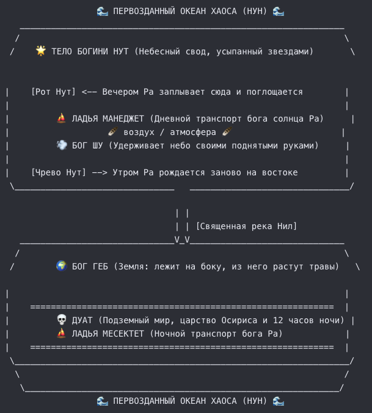
1. Небесная корова или женщина (Нут): Огромное женское тело, изогнутое дугой над землей. Руки и ноги Нут касаются четырех сторон света, формируя опоры неба. Её тело заполнено звездами (неподвижными светилами).
2. Атмосферный разделитель (Шу): Бог воздуха Шу стоит на земле и физически держит Нут над собой, не давая небу упасть на землю. Без его усилий мир мгновенно схлопнулся бы обратно в хаос.
3. Рельефная земля (Геб): Земля — это живое мужское божество, лежащее у ног Шу. Неровности ландшафта (холмы, горы) — это изгибы его тела. Зелень на планете считалась волосами Геба.
4. Космические Ладьи Ра: Солнце путешествует не на повозке, а на лодках по небесной глади (которая считалась верхним продолжением Нила). Днем Ра плывет на ладье Манеджет, а ночью опускается под землю на ладье Месектет.
5. Подземный лабиринт (Дуат): Нижний мир, где правит Осирис. Он поделен на 12 регионов (часов ночи), разделенных массивными вратами под охраной демонов. Каждую ночь Ра сражается здесь со змеем хаоса Апопом, чтобы утром снова родиться из лона Нут.
6. Внешние воды (Нун): Бескрайняя холодная пучина, окружающая весь защищенный египетский космос со всех сторон. Считалось, что Нил вытекает напрямую из этих предвечных вод.
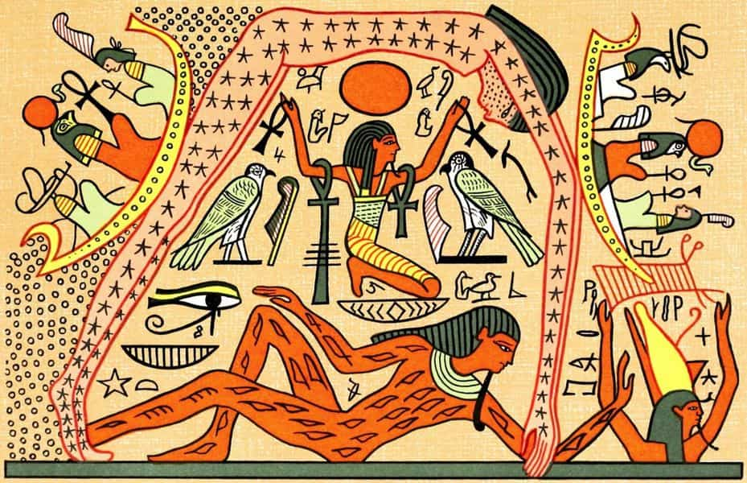
1. Небесная корова или женщина (Нут): Огромное женское тело, изогнутое дугой над землей. Руки и ноги Нут касаются четырех сторон света, формируя опоры неба. Её тело заполнено звездами (неподвижными светилами).
2. Атмосферный разделитель (Шу): Бог воздуха Шу стоит на земле и физически держит Нут над собой, не давая небу упасть на землю. Без его усилий мир мгновенно схлопнулся бы обратно в хаос.
3. Рельефная земля (Геб): Земля — это живое мужское божество, лежащее у ног Шу. Неровности ландшафта (холмы, горы) — это изгибы его тела. Зелень на планете считалась волосами Геба.
4. Космические Ладьи Ра: Солнце путешествует не на повозке, а на лодках по небесной глади (которая считалась верхним продолжением Нила). Днем Ра плывет на ладье Манеджет, а ночью опускается под землю на ладье Месектет.
5. Подземный лабиринт (Дуат): Нижний мир, где правит Осирис. Он поделен на 12 регионов (часов ночи), разделенных массивными вратами под охраной демонов. Каждую ночь Ра сражается здесь со змеем хаоса Апопом, чтобы утром снова родиться из лона Нут.
6. Внешние воды (Нун): Бескрайняя холодная пучина, окружающая весь защищенный египетский космос со всех сторон. Считалось, что Нил вытекает напрямую из этих предвечных вод.

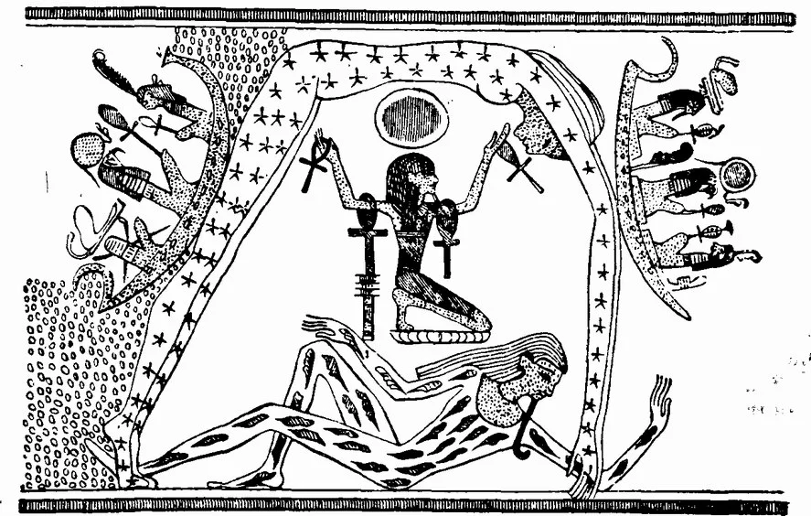

---

### title
*Китай: круглое небо и квадратная земля*
### body
> Модель гайтянь: небо круглое (вращается), земля квадратная (неподвижна). Углы земли не совпадают с краями неба. Поздняя модель хуньтянь: небо как яичная скорлупа, земля как желток внутри. Небо вращается вокруг полярной звезды.
### notes
*Китайские космологические схемы часто включают символику инь-ян и пяти стихий.*
### search
Chinese gai tian cosmology diagram

### article

Космология Древнего Китая принципиально отличалась от ближневосточной: здесь не было антропоморфных богов-гигантов или теомахии. Вместо этого китайская мысль опиралась на геометрию, математику и взаимодействие энергий Инь и Ян. Две главные исторические модели — Гайтянь (Небо-покрывало) и Хуньтянь (Небесная сфера).

## 1. Модель Гайтянь (盖天说) — «Небо-покрывало»
Это древнейшая модель (эпоха Чжоу), основанная на принципе «Тянь юань ди фан» (天圆地方) — «Небо круглое, Земля квадратная». Визуально она напоминает колесницу с зонтом или шахматную доску под круглым куполом.

Ключевые визуальные элементы Гайтянь:

* Круглый купол: Небо вращается вокруг Полярной звезды, как огромный зонт. Светила прикреплены к нему и движутся вместе с куполом.
* Квадратная земля: Земля плоская и неподвижная. Поскольку круг не может полностью закрыть квадрат, углы земли остаются открытыми — там бушуют четыре ветра.
* Четыре моря: Пространство между круглым краем неба и углами квадратной земли заполнено океаном.

## 2. Модель Хуньтянь (浑天说) — «Небесная сфера»
Эта модель возникла позже (окончательно оформлена ученым Чжан Хэном в I–II вв. н.э.) и стала революционной. Она поразительно близка к современной концепции небесной сферы. Чжан Хэн сравнивал Вселенную с куриным яйцом.

Ключевые визуальные элементы Хуньтянь:

* Куриное яйцо: Небо — это скорлупа, а Земля — желток внутри. Небо окружает Землю со всех сторон (включая пространство под ней).
* Космическая вода: Внутри «яйца» течет вода (белок), на поверхности которой плавает Земля. Она удерживает сушу от падения.
* Полный оборот: Небесная сфера совершает полный оборот за сутки. Светила не прячутся в ворота, а уходят под землю, продолжая движение по нижней части сферы.

## 3. Модель Сюанье (宣夜) — «Бесконечная пустота»
Визуально эту модель невозможно заключить в рамки или границы. Это бездонный трехмерный океан разреженного воздуха (энергии Ци), в котором парят космические тела.

Ключевые визуальные элементы Сюанье:

* Отсутствие границ: В отличие от Гайтянь и Хуньтянь, здесь нет «покрывала» или «скорлупы». Небо кажется синим лишь потому, что оно бездонно (как удаленные горы кажутся синеватыми).
* Парящие светила: Солнце, Луна и звезды не прикрепелены ни к какому твердому субстрату. Они состоят из уплотненного светящегося газа (энергии Ян) и «плавают» в пустоте.
* Движущая сила — Ветер: Космические тела движутся неравномерно (одни быстрее, другие медленнее), потому что их несут разные по силе потоки космического воздуха (Ци).

### images
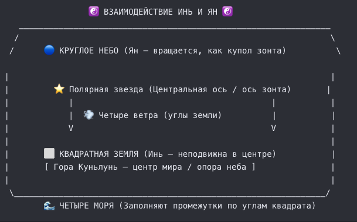
Модель Гайтянь
* Круглый купол: Небо вращается вокруг Полярной звезды, как огромный зонт. Светила прикреплены к нему и движутся вместе с куполом.
* Квадратная земля: Земля плоская и неподвижная. Поскольку круг не может полностью закрыть квадрат, углы земли остаются открытыми — там бушуют четыре ветра.
* Четыре моря: Пространство между круглым краем неба и углами квадратной земли заполнено океаном.

Модель Гайтянь
* Круглый купол: Небо вращается вокруг Полярной звезды, как огромный зонт. Светила прикреплены к нему и движутся вместе с куполом.
* Квадратная земля: Земля плоская и неподвижная. Поскольку круг не может полностью закрыть квадрат, углы земли остаются открытыми — там бушуют четыре ветра.
* Четыре моря: Пространство между круглым краем неба и углами квадратной земли заполнено океаном.
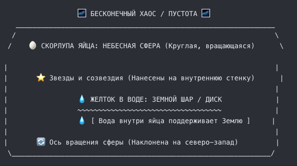
Модель Хуньтянь
* Куриное яйцо: Небо — это скорлупа, а Земля — желток внутри. Небо окружает Землю со всех сторон (включая пространство под ней).
* Космическая вода: Внутри «яйца» течет вода (белок), на поверхности которой плавает Земля. Она удерживает сушу от падения.
* Полный оборот: Небесная сфера совершает полный оборот за сутки. Светила не прячутся в ворота, а уходят под землю, продолжая движение по нижней части сферы.

Модель Хуньтянь
* Куриное яйцо: Небо — это скорлупа, а Земля — желток внутри. Небо окружает Землю со всех сторон (включая пространство под ней).
* Космическая вода: Внутри «яйца» течет вода (белок), на поверхности которой плавает Земля. Она удерживает сушу от падения.
* Полный оборот: Небесная сфера совершает полный оборот за сутки. Светила не прячутся в ворота, а уходят под землю, продолжая движение по нижней части сферы.
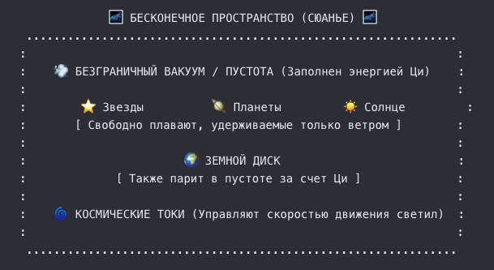
Модель Сюанье (宣夜) — «Бесконечная пустота»
* Отсутствие границ: В отличие от Гайтянь и Хуньтянь, здесь нет «покрывала» или «скорлупы». Небо кажется синим лишь потому, что оно бездонно (как удаленные горы кажутся синеватыми).
* Парящие светила: Солнце, Луна и звезды не прикрепелены ни к какому твердому субстрату. Они состоят из уплотненного светящегося газа (энергии Ян) и «плавают» в пустоте.
* Движущая сила — Ветер: Космические тела движутся неравномерно (одни быстрее, другие медленнее), потому что их несут разные по силе потоки космического воздуха (Ци).

---

### title
*Древняя Греция: мир богов, титанов и героев*
### body
> Изначальный хаос. Из него возникли Гея (Земля), Тартар (бездна), Эрос (любовь), Эреб (мрак) и Нюкта (ночь). Гея родила Урана (Небо). Уран и Гея — родители титанов. Зевс и олимпийские боги свергли титанов. Олимп — небесная гора, обитель богов. Под землёй — царство Аида (мёртвые). Мир разделён между тремя братьями: Зевс (небо), Посейдон (море), Аид (подземный мир).
### notes
*Тартар — глубокая бездна под Землёй, куда Зевс низверг титанов. Океан — река, омывающая плоскую Землю.*
### search
Greek mythology cosmos Gaia Uranus Tartarus Olympus diagram

### article

Космологическая мысль Древней Греции развивалась от антропоморфных образов к геометрическим и механическим моделям.

## 1. Ранняя мифологическая модель (Гомер, Гесиод — VIII–VII вв. до н.э.)
Система описывает Вселенную как закрытую структуру, обладающую вертикальной и радиальной симметрией. Все элементы космоса одновременно являются физическими локациями и живыми сущностями (титанами и богами).

* Небесный свод (Уран): Массивный неподвижный купол из кованой бронзы или железа. Опирается на края земного диска или удерживается титаном Атлантом на западе. По его внутренней стороне движутся колесницы Солнца (Гелиоса) и Луны (Селены).
* Земной диск (Гея) и Океан: Плоская круглая суша в форме щита, окруженная кольцевым пресноводным потоком — рекой Океан. Океан является границей известного мира; из него восходят и в него заходят все светила.
* Подземные ярусы: Непосредственно под земной корой расположен Аид (обитель умерших). Глубже находится Тартар — бездна, изолированная медной стеной. Расстояние от Земли до дна Тартара равно расстоянию от Земли до неба (9 дней полета медной наковальни).

## 2. Досократическая модель Анаксимандра (VI в. до н.э.)
Первая геометрическая модель, в которой пространственная структура задается осевой симметрией. Земля занимает центральное положение, а небесные тела представляют собой гигантские невидимые кольца (торы), окружающие ее.

* Форма Земли: Неподвижный цилиндр («барабан»), верхнее плоское основание которого является обитаемой сушей. Земля ни на что не опирается и удерживается в центре за счет геометрического баланса (равноудаленности от всех краев космоса).
* Механизм светил: Небесные тела — это полые трубчатые кольца, заполненные скрытым огнем. Нам этот огонь виден в форме точек или дисков через дискретные отверстия («форточки») в оболочке колец. Временное перекрытие этих отверстий формирует феномен затмений.
* Параметры орбит: Размеры колец строго кратны трем. Диаметр кольца звезд равен 9 диаметрам Земли, кольца Луны — 18, кольца Солнца — 27. Вся система окружена бесконечной субстанцией — Апейроном.

## 3. Пифагорейская модель Филолая (V в. до н.э.)
Математическая негеоцентрическая модель, построенная на принципе числовой гармонии. Все космические тела, включая Землю, совершают круговые движения вокруг единого энергетического центра.

* Космическая иерархия: Система состоит из 10 концентрических сфер, вращающихся вокруг Центрального Огня (Гестии). Порядок удаления от центра: Антихтон, Земля, Луна, Солнце, 5 планет (Меркурий, Венера, Марс, Юпитер, Сатурн) и внешняя сфера неподвижных звезд.
* Антихтон (Противоземля): Тело, введенное для округления числа движущихся сфер до «совершенного» числа 10. Оно вращается синхронно между Центральным Огнем и Землей, всегда загораживая Огонь от обитаемой стороны Земли.
* Природа солнечного света: Солнце в этой модели не генерирует собственную энергию, а функционирует как гигантское сферическое зеркало или линза, которая улавливает лучи Центрального Огня и перенаправляет их во внешнее пространство.

## 4. Геоцентрическая модель Аристотеля (IV в. до н.э.)
Классическая физико-геометрическая система, основанная на стратификации элементов по плотности и делении Вселенной на две зоны с принципиально разными законами физики.

* Подлунный мир: Область от центра Вселенной до орбиты Луны. Состоит из четырех тяжелых первоэлементов (Земля, Вода, Воздух, Огонь). Элементы стремятся занять свои естественные места по плотности посредством прямолинейного движения: тяжелая Земля образует шар в самом центре, над ней располагаются оболочки Воды, Воздуха и Огня. Данная зона подвержена распаду и изменениям.
* Надлунный мир: Область от Луны до внешней границы космоса. Состоит из неизменного пятого элемента — Эфира. Все космические тела жестко закреплены на концентрических хрустальных сферах. Единственный возможный вид движения здесь — идеальное, вечное и равномерное вращение по кругу.
* Динамика системы: Движение передается механическим путем (за счет трения сфер) от самой внешней границы — Перводвигателя — последовательно вниз ко всем внутренним планетным сферам. В общей сложности модель Аристотеля насчитывала 55 взаимосвязанных сфер.

### images
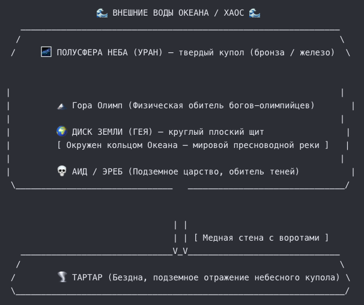
Ранняя мифологическая модель (Гомер, Гесиод — VIII–VII вв. до н.э.)
Система описывает Вселенную как закрытую структуру, обладающую вертикальной и радиальной симметрией. Все элементы космоса одновременно являются физическими локациями и живыми сущностями (титанами и богами).

* Небесный свод (Уран): Массивный неподвижный купол из кованой бронзы или железа. Опирается на края земного диска или удерживается титаном Атлантом на западе. По его внутренней стороне движутся колесницы Солнца (Гелиоса) и Луны (Селены).
* Земной диск (Гея) и Океан: Плоская круглая суша в форме щита, окруженная кольцевым пресноводным потоком — рекой Океан. Океан является границей известного мира; из него восходят и в него заходят все светила.
* Подземные ярусы: Непосредственно под земной корой расположен Аид (обитель умерших). Глубже находится Тартар — бездна, изолированная медной стеной. Расстояние от Земли до дна Тартара равно расстоянию от Земли до неба (9 дней полета медной наковальни).

Ранняя мифологическая модель (Гомер, Гесиод — VIII–VII вв. до н.э.)
Система описывает Вселенную как закрытую структуру, обладающую вертикальной и радиальной симметрией. Все элементы космоса одновременно являются физическими локациями и живыми сущностями (титанами и богами).

* Небесный свод (Уран): Массивный неподвижный купол из кованой бронзы или железа. Опирается на края земного диска или удерживается титаном Атлантом на западе. По его внутренней стороне движутся колесницы Солнца (Гелиоса) и Луны (Селены).
* Земной диск (Гея) и Океан: Плоская круглая суша в форме щита, окруженная кольцевым пресноводным потоком — рекой Океан. Океан является границей известного мира; из него восходят и в него заходят все светила.
* Подземные ярусы: Непосредственно под земной корой расположен Аид (обитель умерших). Глубже находится Тартар — бездна, изолированная медной стеной. Расстояние от Земли до дна Тартара равно расстоянию от Земли до неба (9 дней полета медной наковальни).

Ранняя мифологическая модель (Гомер, Гесиод — VIII–VII вв. до н.э.)
Система описывает Вселенную как закрытую структуру, обладающую вертикальной и радиальной симметрией. Все элементы космоса одновременно являются физическими локациями и живыми сущностями (титанами и богами).

* Небесный свод (Уран): Массивный неподвижный купол из кованой бронзы или железа. Опирается на края земного диска или удерживается титаном Атлантом на западе. По его внутренней стороне движутся колесницы Солнца (Гелиоса) и Луны (Селены).
* Земной диск (Гея) и Океан: Плоская круглая суша в форме щита, окруженная кольцевым пресноводным потоком — рекой Океан. Океан является границей известного мира; из него восходят и в него заходят все светила.
* Подземные ярусы: Непосредственно под земной корой расположен Аид (обитель умерших). Глубже находится Тартар — бездна, изолированная медной стеной. Расстояние от Земли до дна Тартара равно расстоянию от Земли до неба (9 дней полета медной наковальни).
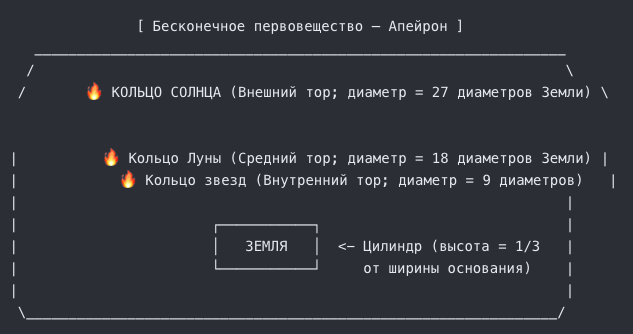
Досократическая модель Анаксимандра (VI в. до н.э.)
Первая геометрическая модель, в которой пространственная структура задается осевой симметрией. Земля занимает центральное положение, а небесные тела представляют собой гигантские невидимые кольца (торы), окружающие ее.

* Форма Земли: Неподвижный цилиндр («барабан»), верхнее плоское основание которого является обитаемой сушей. Земля ни на что не опирается и удерживается в центре за счет геометрического баланса (равноудаленности от всех краев космоса).
* Механизм светил: Небесные тела — это полые трубчатые кольца, заполненные скрытым огнем. Нам этот огонь виден в форме точек или дисков через дискретные отверстия («форточки») в оболочке колец. Временное перекрытие этих отверстий формирует феномен затмений.
* Параметры орбит: Размеры колец строго кратны трем. Диаметр кольца звезд равен 9 диаметрам Земли, кольца Луны — 18, кольца Солнца — 27. Вся система окружена бесконечной субстанцией — Апейроном.
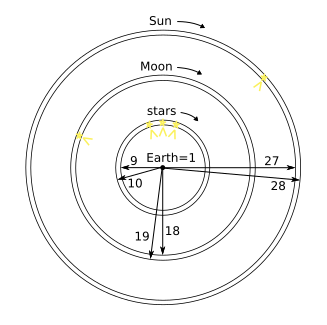
Земля занимает центральное положение, а небесные тела представляют собой гигантские невидимые кольца (торы), окружающие ее.

* Форма Земли: Неподвижный цилиндр («барабан»), верхнее плоское основание которого является обитаемой сушей. Земля ни на что не опирается и удерживается в центре за счет геометрического баланса (равноудаленности от всех краев космоса).
* Механизм светил: Небесные тела — это полые трубчатые кольца, заполненные скрытым огнем. Нам этот огонь виден в форме точек или дисков через дискретные отверстия («форточки») в оболочке колец. Временное перекрытие этих отверстий формирует феномен затмений.
* Параметры орбит: Размеры колец строго кратны трем. Диаметр кольца звезд равен 9 диаметрам Земли, кольца Луны — 18, кольца Солнца — 27. Вся система окружена бесконечной субстанцией — Апейроном.
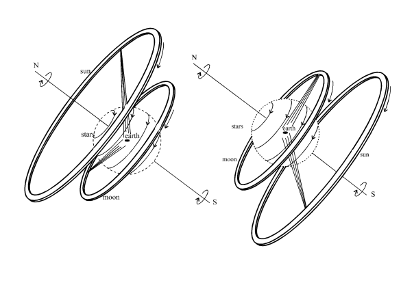
Земля занимает центральное положение, а небесные тела представляют собой гигантские невидимые кольца (торы), окружающие ее.

* Форма Земли: Неподвижный цилиндр («барабан»), верхнее плоское основание которого является обитаемой сушей. Земля ни на что не опирается и удерживается в центре за счет геометрического баланса (равноудаленности от всех краев космоса).
* Механизм светил: Небесные тела — это полые трубчатые кольца, заполненные скрытым огнем. Нам этот огонь виден в форме точек или дисков через дискретные отверстия («форточки») в оболочке колец. Временное перекрытие этих отверстий формирует феномен затмений.
* Параметры орбит: Размеры колец строго кратны трем. Диаметр кольца звезд равен 9 диаметрам Земли, кольца Луны — 18, кольца Солнца — 27. Вся система окружена бесконечной субстанцией — Апейроном.
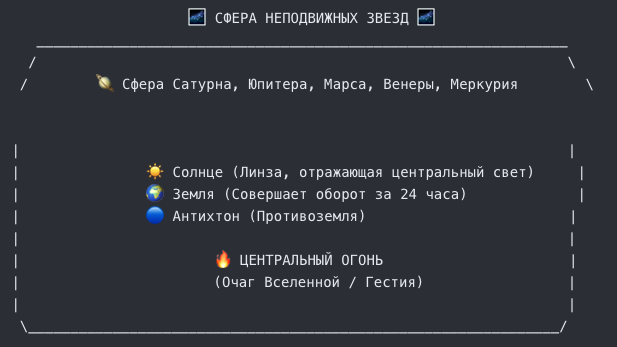
Все космические тела, включая Землю, совершают круговые движения вокруг единого энергетического центра.

* Космическая иерархия: Система состоит из 10 концентрических сфер, вращающихся вокруг Центрального Огня (Гестии). Порядок удаления от центра: Антихтон, Земля, Луна, Солнце, 5 планет (Меркурий, Венера, Марс, Юпитер, Сатурн) и внешняя сфера неподвижных звезд.
* Антихтон (Противоземля): Тело, введенное для округления числа движущихся сфер до «совершенного» числа 10. Оно вращается синхронно между Центральным Огнем и Землей, всегда загораживая Огонь от обитаемой стороны Земли.
* Природа солнечного света: Солнце в этой модели не генерирует собственную энергию, а функционирует как гигантское сферическое зеркало или линза, которая улавливает лучи Центрального Огня и перенаправляет их во внешнее пространство.
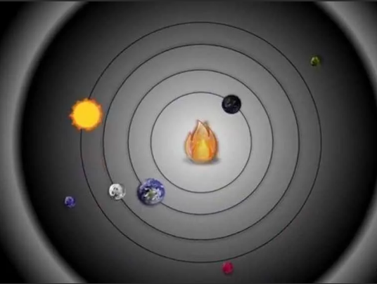
Все космические тела, включая Землю, совершают круговые движения вокруг единого энергетического центра.

* Космическая иерархия: Система состоит из 10 концентрических сфер, вращающихся вокруг Центрального Огня (Гестии). Порядок удаления от центра: Антихтон, Земля, Луна, Солнце, 5 планет (Меркурий, Венера, Марс, Юпитер, Сатурн) и внешняя сфера неподвижных звезд.
* Антихтон (Противоземля): Тело, введенное для округления числа движущихся сфер до «совершенного» числа 10. Оно вращается синхронно между Центральным Огнем и Землей, всегда загораживая Огонь от обитаемой стороны Земли.
* Природа солнечного света: Солнце в этой модели не генерирует собственную энергию, а функционирует как гигантское сферическое зеркало или линза, которая улавливает лучи Центрального Огня и перенаправляет их во внешнее пространство.
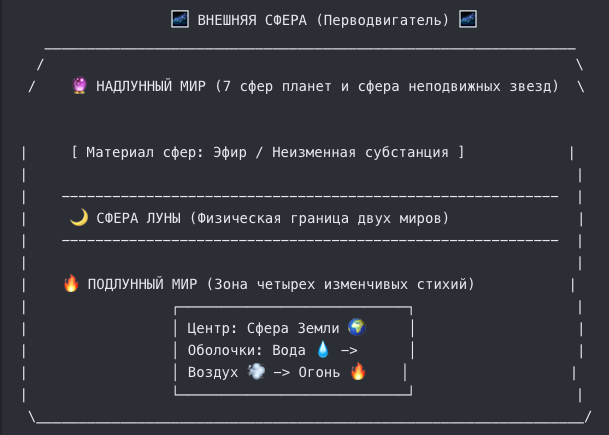
Геоцентрическая модель Аристотеля (IV в. до н.э.)
Классическая физико-геометрическая система, основанная на стратификации элементов по плотности и делении Вселенной на две зоны с принципиально разными законами физики.

* Подлунный мир: Область от центра Вселенной до орбиты Луны. Состоит из четырех тяжелых первоэлементов (Земля, Вода, Воздух, Огонь). Элементы стремятся занять свои естественные места по плотности посредством прямолинейного движения: тяжелая Земля образует шар в самом центре, над ней располагаются оболочки Воды, Воздуха и Огня. Данная зона подвержена распаду и изменениям.
* Надлунный мир: Область от Луны до внешней границы космоса. Состоит из неизменного пятого элемента — Эфира. Все космические тела жестко закреплены на концентрических хрустальных сферах. Единственный возможный вид движения здесь — идеальное, вечное и равномерное вращение по кругу.
* Динамика системы: Движение передается механическим путем (за счет трения сфер) от самой внешней границы — Перводвигателя — последовательно вниз ко всем внутренним планетным сферам. В общей сложности модель Аристотеля насчитывала 55 взаимосвязанных сфер.
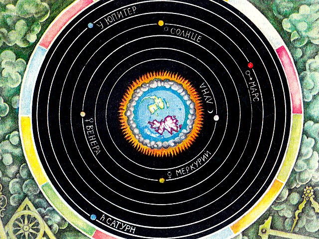
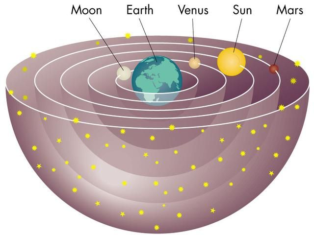

---

### title
*Греция: сферическая Земля в центре Вселенной*
### body
> Земля — сфера в центре Вселенной. Вокруг неё — концентрические хрустальные сферы: Луна, Меркурий, Венера, Солнце, Марс, Юпитер, Сатурн, сфера неподвижных звёзд. За последней сферой — перводвигатель.
### notes
*Эта модель доминировала в западной науке около 1500 лет. Птолемей добавил эпициклы для объяснения петлеобразного движения планет.*
### search
Ptolemaic geocentric model spheres

### article

Геоцентрическая модель Аристотеля — Птолемея.

* Центральное тело: Земля представляет собой неподвижную сферу, зафиксированную в абсолютном центре Вселенной. Её статичность обосновывалась физикой Аристотеля: тяжелые элементы падают к центру, достигая там состояния покоя.
* Концентрические сферы: Светила закреплены на жестких, абсолютно прозрачных оболочках из «кристалла» (эфира). Они вложены друг в друга и вращаются вокруг Земли на разных скоростях. Иерархия удаления: Луна → Меркурий → Венера → Солнце → Марс → Юпитер → Сатурн → Сфера звезд.
* Перводвигатель (Primum Mobile): Самая внешняя, чистая сфера, не содержащая звезд. Она совершает полный оборот за 24 часа и за счет механического трения передает крутящий момент всем внутренним сферам, приводя Вселенную в движение.
* Математический аппарат эпициклов: Для устранения расхождений с наблюдениями — таких как неравномерная скорость светил и ретроградные петли планет — Птолемей разделил круговое движение на две составляющие. Планета обращается по малому кругу (эпициклу), а центр этого эпицикла скользит по большой круговой орбите вокруг Земли (деференту). 

### images
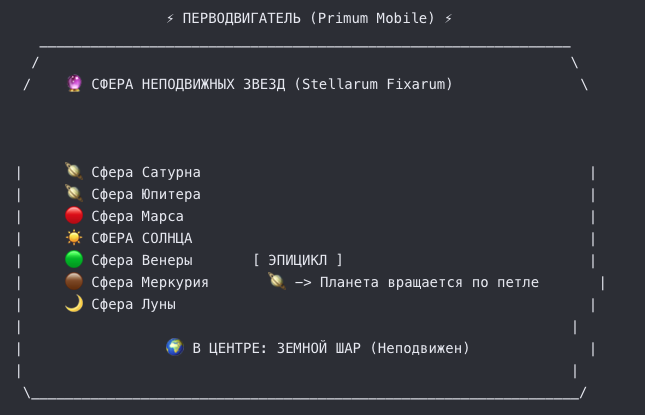
Геоцентрическая модель Аристотеля — Птолемея.

* Центральное тело: Земля представляет собой неподвижную сферу, зафиксированную в абсолютном центре Вселенной. Её статичность обосновывалась физикой Аристотеля: тяжелые элементы падают к центру, достигая там состояния покоя.
* Концентрические сферы: Светила закреплены на жестких, абсолютно прозрачных оболочках из «кристалла» (эфира). Они вложены друг в друга и вращаются вокруг Земли на разных скоростях. Иерархия удаления: Луна → Меркурий → Венера → Солнце → Марс → Юпитер → Сатурн → Сфера звезд.
* Перводвигатель (Primum Mobile): Самая внешняя, чистая сфера, не содержащая звезд. Она совершает полный оборот за 24 часа и за счет механического трения передает крутящий момент всем внутренним сферам, приводя Вселенную в движение.
* Математический аппарат эпициклов: Для устранения расхождений с наблюдениями — таких как неравномерная скорость светил и ретроградные петли планет — Птолемей разделил круговое движение на две составляющие. Планета обращается по малому кругу (эпициклу), а центр этого эпицикла скользит по большой круговой орбите вокруг Земли (деференту).

Геоцентрическая модель Аристотеля — Птолемея.

* Центральное тело: Земля представляет собой неподвижную сферу, зафиксированную в абсолютном центре Вселенной. Её статичность обосновывалась физикой Аристотеля: тяжелые элементы падают к центру, достигая там состояния покоя.
* Концентрические сферы: Светила закреплены на жестких, абсолютно прозрачных оболочках из «кристалла» (эфира). Они вложены друг в друга и вращаются вокруг Земли на разных скоростях. Иерархия удаления: Луна → Меркурий → Венера → Солнце → Марс → Юпитер → Сатурн → Сфера звезд.
* Перводвигатель (Primum Mobile): Самая внешняя, чистая сфера, не содержащая звезд. Она совершает полный оборот за 24 часа и за счет механического трения передает крутящий момент всем внутренним сферам, приводя Вселенную в движение.
* Математический аппарат эпициклов: Для устранения расхождений с наблюдениями — таких как неравномерная скорость светил и ретроградные петли планет — Птолемей разделил круговое движение на две составляющие. Планета обращается по малому кругу (эпициклу), а центр этого эпицикла скользит по большой круговой орбите вокруг Земли (деференту).

Геоцентрическая модель Аристотеля — Птолемея.

* Центральное тело: Земля представляет собой неподвижную сферу, зафиксированную в абсолютном центре Вселенной. Её статичность обосновывалась физикой Аристотеля: тяжелые элементы падают к центру, достигая там состояния покоя.
* Концентрические сферы: Светила закреплены на жестких, абсолютно прозрачных оболочках из «кристалла» (эфира). Они вложены друг в друга и вращаются вокруг Земли на разных скоростях. Иерархия удаления: Луна → Меркурий → Венера → Солнце → Марс → Юпитер → Сатурн → Сфера звезд.
* Перводвигатель (Primum Mobile): Самая внешняя, чистая сфера, не содержащая звезд. Она совершает полный оборот за 24 часа и за счет механического трения передает крутящий момент всем внутренним сферам, приводя Вселенную в движение.
* Математический аппарат эпициклов: Для устранения расхождений с наблюдениями — таких как неравномерная скорость светил и ретроградные петли планет — Птолемей разделил круговое движение на две составляющие. Планета обращается по малому кругу (эпициклу), а центр этого эпицикла скользит по большой круговой орбите вокруг Земли (деференту).

Геоцентрическая модель Аристотеля — Птолемея.

* Центральное тело: Земля представляет собой неподвижную сферу, зафиксированную в абсолютном центре Вселенной. Её статичность обосновывалась физикой Аристотеля: тяжелые элементы падают к центру, достигая там состояния покоя.
* Концентрические сферы: Светила закреплены на жестких, абсолютно прозрачных оболочках из «кристалла» (эфира). Они вложены друг в друга и вращаются вокруг Земли на разных скоростях. Иерархия удаления: Луна → Меркурий → Венера → Солнце → Марс → Юпитер → Сатурн → Сфера звезд.
* Перводвигатель (Primum Mobile): Самая внешняя, чистая сфера, не содержащая звезд. Она совершает полный оборот за 24 часа и за счет механического трения передает крутящий момент всем внутренним сферам, приводя Вселенную в движение.
* Математический аппарат эпициклов: Для устранения расхождений с наблюдениями — таких как неравномерная скорость светил и ретроградные петли планет — Птолемей разделил круговое движение на две составляющие. Планета обращается по малому кругу (эпициклу), а центр этого эпицикла скользит по большой круговой орбите вокруг Земли (деференту).

Геоцентрическая модель Аристотеля — Птолемея.

* Центральное тело: Земля представляет собой неподвижную сферу, зафиксированную в абсолютном центре Вселенной. Её статичность обосновывалась физикой Аристотеля: тяжелые элементы падают к центру, достигая там состояния покоя.
* Концентрические сферы: Светила закреплены на жестких, абсолютно прозрачных оболочках из «кристалла» (эфира). Они вложены друг в друга и вращаются вокруг Земли на разных скоростях. Иерархия удаления: Луна → Меркурий → Венера → Солнце → Марс → Юпитер → Сатурн → Сфера звезд.
* Перводвигатель (Primum Mobile): Самая внешняя, чистая сфера, не содержащая звезд. Она совершает полный оборот за 24 часа и за счет механического трения передает крутящий момент всем внутренним сферам, приводя Вселенную в движение.
* Математический аппарат эпициклов: Для устранения расхождений с наблюдениями — таких как неравномерная скорость светил и ретроградные петли планет — Птолемей разделил круговое движение на две составляющие. Планета обращается по малому кругу (эпициклу), а центр этого эпицикла скользит по большой круговой орбите вокруг Земли (деференту).

---

### title
*Данте Алигьери: синтез средневековой космологии*
### body
> Земля в центре. 9 кругов Ада (конус к центру Земли, Люцифер внизу). Гора Чистилища (7 уступов + Земной Рай). 9 небесных сфер (Луна → Меркурий → Венера → Солнце → Марс → Юпитер → Сатурн → Неподвижные звёзды → Первичный двигатель). За ними — Эмпирей (нематериальное небо, обитель Бога). Вся вселенная — 3-сфера: две полусферы, склеенные по границе.
### notes
*Данте первым предложил, что вселенная может быть трёхмерной сферой (3-sphere). Символика чисел: 3 (Троица), 7 (совершенство), 9 (божественный порядок), 10 (полнота).*
### search
Dante Divine Comedy cosmology diagram concentric spheres

### article

Космология Данте Алигьери, описанная в поэме «Божественная комедия» (начало XIV века), представляет собой грандиозный синтез средневекового католического богословия и геоцентрической астрономии Аристотеля.
Данте не создавал новую физическую модель, но он совершил уникальное пространственное преобразование: он топологически объединил материальный физический космос Птолемея с духовным нематериальным миром христианской метафизики, создав зеркальную структуру.

## Анатомия и устройство элементов космоса Данте

* Центр притяжения и греха (Земной шар): Земля неподвижно покоится в центре материального мира. Внутри нее находится воронка Ада, которая образовалась, когда низвергнутый с небес Сатана (Люцифер) пробил земную кору. Люцифер находится в самой глубокой точке Ада (9-й круг, ледяное озеро Коцит), которая физически совпадает с абсолютным центром тяжести Вселенной. Люцифер зафиксирован в центре тяжести как символ предельного удаления от Бога и абсолютного духовного застоя.
* Симметрия полушарий:
1. Северное полушарие: обитаемая суша («населенная четверть»), в центре которой находится священный город Иерусалим.
   2. Южное полушарие: полностью покрыто мировым океаном. Посреди него возвышается единственная суша — колоссальная Гора Чистилища, возникшая из земли, вытесненной Сатаной при падении. На вершине горы расположен Земной Рай (Эдем).
* Семь планетных небес и Сфера Звезд: Поднимаясь из Земного Рая вверх, душа Данте последовательно проходит через физические птолемеевские небеса (сферы Луны, Меркурия, Венеры, Солнца, Марса, Юпитера, Сатурна) и 8-е Небо звезд. Каждое небо соответствует определенной ступени праведности и наполнено блаженными душами.
* Перводвигатель (Девятое небо): Высшая граница материального, осязаемого мира. Это небо совершенно прозрачно и не содержит светил, но оно вращается с наивысшей скоростью, транслируя движение и время на все нижележащие сферы.
* Духовный мир (Эмпирей): За пределами Перводвигателя материальное пространство исчезает. Там начинается Эмпирей — мир чистого божественного света и духа, не имеющий физических размеров. В Эмпирее Данте видит зеркальное отражение материального космоса: там вокруг бесконечно малой, но ослепительно яркой Точки (Бога) вращаются 9 концентрических колец ангельских чинов (Серафимы, Херувимы и т.д.). Праведники в Эмпирее образуют мистическую Белую Розу вокруг божественного центра.

## Главные особенности модели

* Двойной центр: Модель Данте обладает поразительным топологическим свойством. В ней есть два центра: геометрический и материальный центр — это Земля (где заперто абсолютное Зло), но истинный, духовный центр всего сущего — это Бог в Эмпирее (абсолютное Благо), вокруг которого вращается вся нематериальная Вселенная.
* Иерархия движения: Чем ближе материальное небо к Богу, тем быстрее оно вращается. И наоборот, в ангельских духовных сферах — чем ближе ангелы к божественной Точке, тем стремительнее и пламеннее их кружение.

### images
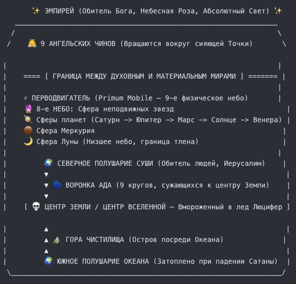
* Центр притяжения и греха (Земной шар): Земля неподвижно покоится в центре материального мира. Внутри нее находится воронка Ада, которая образовалась, когда низвергнутый с небес Сатана (Люцифер) пробил земную кору. Люцифер находится в самой глубокой точке Ада (9-й круг, ледяное озеро Коцит), которая физически совпадает с абсолютным центром тяжести Вселенной. Люцифер зафиксирован в центре тяжести как символ предельного удаления от Бога и абсолютного духовного застоя.
* Симметрия полушарий:
1. Северное полушарие: обитаемая суша («населенная четверть»), в центре которой находится священный город Иерусалим.
   2. Южное полушарие: полностью покрыто мировым океаном. Посреди него возвышается единственная суша — колоссальная Гора Чистилища, возникшая из земли, вытесненной Сатаной при падении. На вершине горы расположен Земной Рай (Эдем).
* Семь планетных небес и Сфера Звезд: Поднимаясь из Земного Рая вверх, душа Данте последовательно проходит через физические птолемеевские небеса (сферы Луны, Меркурия, Венеры, Солнца, Марса, Юпитера, Сатурна) и 8-е Небо звезд. Каждое небо соответствует определенной ступени праведности и наполнено блаженными душами.
* Перводвигатель (Девятое небо): Высшая граница материального, осязаемого мира. Это небо совершенно прозрачно и не содержит светил, но оно вращается с наивысшей скоростью, транслируя движение и время на все нижележащие сферы.
* Духовный мир (Эмпирей): За пределами Перводвигателя материальное пространство исчезает. Там начинается Эмпирей — мир чистого божественного света и духа, не имеющий физических размеров. В Эмпирее Данте видит зеркальное отражение материального космоса: там вокруг бесконечно малой, но ослепительно яркой Точки (Бога) вращаются 9 концентрических колец ангельских чинов (Серафимы, Херувимы и т.д.). Праведники в Эмпирее образуют мистическую Белую Розу вокруг божественного центра.

* Центр притяжения и греха (Земной шар): Земля неподвижно покоится в центре материального мира. Внутри нее находится воронка Ада, которая образовалась, когда низвергнутый с небес Сатана (Люцифер) пробил земную кору. Люцифер находится в самой глубокой точке Ада (9-й круг, ледяное озеро Коцит), которая физически совпадает с абсолютным центром тяжести Вселенной. Люцифер зафиксирован в центре тяжести как символ предельного удаления от Бога и абсолютного духовного застоя.
* Симметрия полушарий:
1. Северное полушарие: обитаемая суша («населенная четверть»), в центре которой находится священный город Иерусалим.
   2. Южное полушарие: полностью покрыто мировым океаном. Посреди него возвышается единственная суша — колоссальная Гора Чистилища, возникшая из земли, вытесненной Сатаной при падении. На вершине горы расположен Земной Рай (Эдем).
* Семь планетных небес и Сфера Звезд: Поднимаясь из Земного Рая вверх, душа Данте последовательно проходит через физические птолемеевские небеса (сферы Луны, Меркурия, Венеры, Солнца, Марса, Юпитера, Сатурна) и 8-е Небо звезд. Каждое небо соответствует определенной ступени праведности и наполнено блаженными душами.
* Перводвигатель (Девятое небо): Высшая граница материального, осязаемого мира. Это небо совершенно прозрачно и не содержит светил, но оно вращается с наивысшей скоростью, транслируя движение и время на все нижележащие сферы.
* Духовный мир (Эмпирей): За пределами Перводвигателя материальное пространство исчезает. Там начинается Эмпирей — мир чистого божественного света и духа, не имеющий физических размеров. В Эмпирее Данте видит зеркальное отражение материального космоса: там вокруг бесконечно малой, но ослепительно яркой Точки (Бога) вращаются 9 концентрических колец ангельских чинов (Серафимы, Херувимы и т.д.). Праведники в Эмпирее образуют мистическую Белую Розу вокруг божественного центра.
  
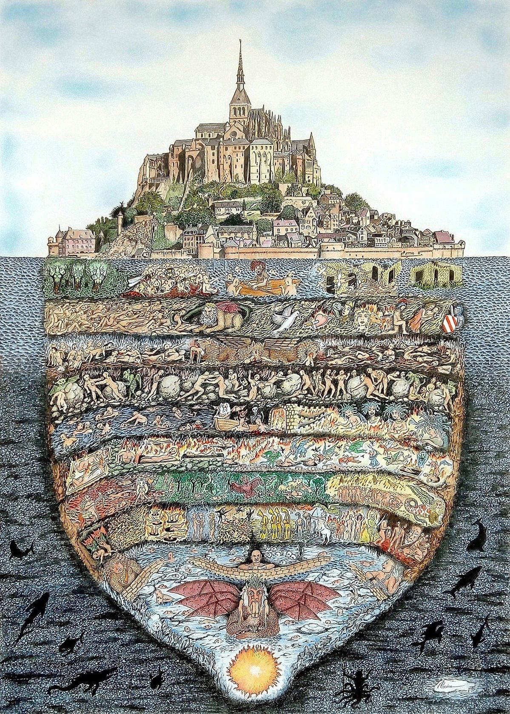
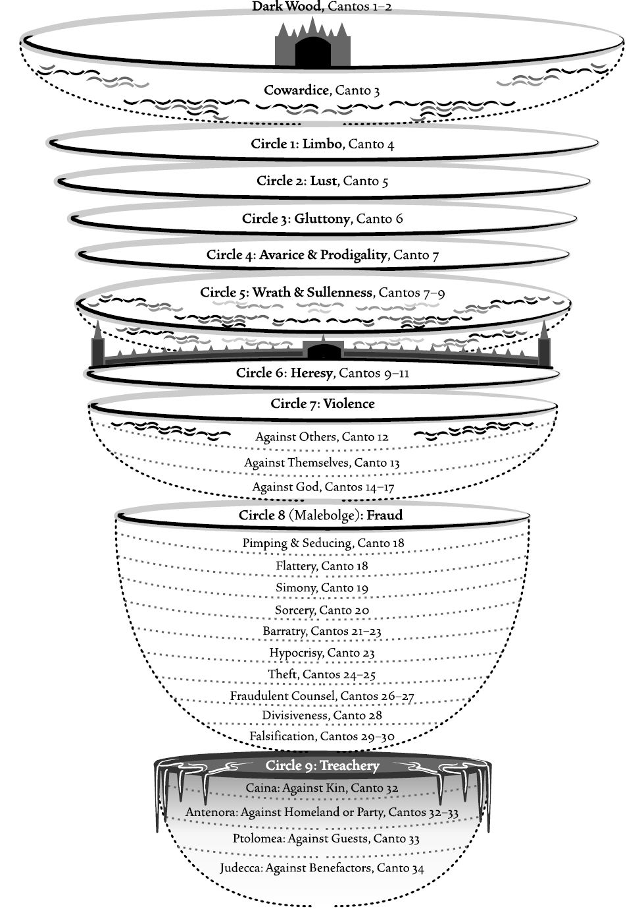

---

### title
*Гелиоцентрическая модель Николая Коперника*
### body
> Солнце в центре вселенной
### notes
*Гелиоцентрическая модель Николая Коперника (опубликованная в 1543 году в трактате «О вращении небесных сфер») радикально изменила структуру космоса, поместив в его центр Солнце. При этом Коперник сохранил античное представление о том, что небесные тела закреплены на твердых хрустальных сферах и движутся по идеальным круговым орбитам.*

### article

Гелиоцентрическая модель Николая Коперника (опубликованная в 1543 году в трактате «О вращении небесных сфер») радикально изменила структуру космоса, поместив в его центр Солнце. При этом Коперник сохранил античное представление о том, что небесные тела закреплены на твердых хрустальных сферах и движутся по идеальным круговым орбитам.

* Центральное светило: Солнце (Sol) занимает положение в абсолютном центре Вселенной и является полностью неподвижным. Коперник описывал его как «лампу», которая освещает весь космос из единой точки.
* Статус и движения Земли: Земля лишается статуса центра мира и превращается в обычную планету, закрепленную на третьей концентрической сфере. Коперник наделил Землю тремя движениями:
1. Суточное вращение: вокруг своей оси с запада на восток (что объясняет видимый восход и заход звезд).
   1. Годичное обращение: вокруг Солнца по круговой орбите.
   2. Девиация (коническое движение): медленное вращение земной оси для сохранения ее постоянного наклона в пространстве.
* Сфера Луны: Луна перестает быть самостоятельной планетой. Она закреплена на малой сфере, центр которой привязан к Земле, и обращается вокруг нее, увлекаясь вслед за Землей по общей околосолнечной орбите.
* Сфера неподвижных звезд: Самая внешняя сфера становится абсолютно статичной (в отличие от модели Птолемея, где она вращалась со скоростью один оборот в сутки). Видимое движение звезд теперь признается оптической иллюзией, вызванной вращением самой Земли. Размеры этой сферы были колоссально увеличены, чтобы объяснить отсутствие видимого смещения звезд (параллакса).
* Сохранение эпициклов: Поскольку Коперник настаивал на идеальных круговых орбитах, его модель не могла точно совпасть с реальными неравномерными скоростями планет. Чтобы «спасти явления», ему пришлось сохранить птолемеевский механизм малых эпициклов и эксцентриков, сдвинув Солнце чуть в сторону от истинного геометрического центра планетных орбит. В общей сложности его система использовала около 34 кругов.

### images

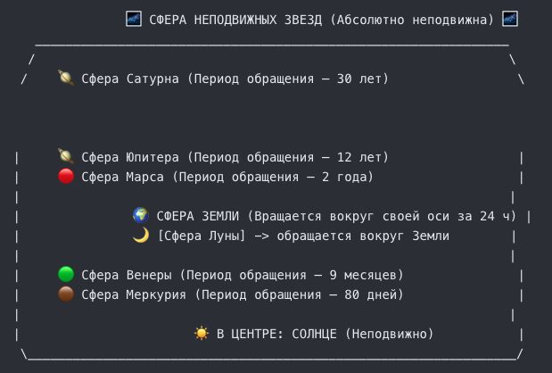
* Центральное светило: Солнце (Sol) занимает положение в абсолютном центре Вселенной и является полностью неподвижным. Коперник описывал его как «лампу», которая освещает весь космос из единой точки.
* Статус и движения Земли: Земля лишается статуса центра мира и превращается в обычную планету, закрепленную на третьей концентрической сфере. Коперник наделил Землю тремя движениями:
1. Суточное вращение: вокруг своей оси с запада на восток (что объясняет видимый восход и заход звезд).
   1. Годичное обращение: вокруг Солнца по круговой орбите.
   2. Девиация (коническое движение): медленное вращение земной оси для сохранения ее постоянного наклона в пространстве.
* Сфера Луны: Луна перестает быть самостоятельной планетой. Она закреплена на малой сфере, центр которой привязан к Земле, и обращается вокруг нее, увлекаясь вслед за Землей по общей околосолнечной орбите.
* Сфера неподвижных звезд: Самая внешняя сфера становится абсолютно статичной (в отличие от модели Птолемея, где она вращалась со скоростью один оборот в сутки). Видимое движение звезд теперь признается оптической иллюзией, вызванной вращением самой Земли. Размеры этой сферы были колоссально увеличены, чтобы объяснить отсутствие видимого смещения звезд (параллакса).
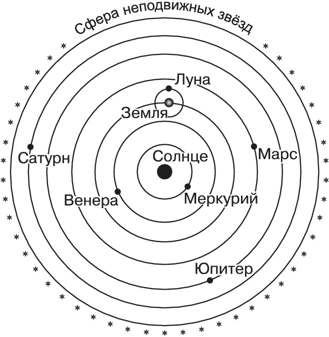
* Центральное светило: Солнце (Sol) занимает положение в абсолютном центре Вселенной и является полностью неподвижным. Коперник описывал его как «лампу», которая освещает весь космос из единой точки.
* Статус и движения Земли: Земля лишается статуса центра мира и превращается в обычную планету, закрепленную на третьей концентрической сфере. Коперник наделил Землю тремя движениями:
1. Суточное вращение: вокруг своей оси с запада на восток (что объясняет видимый восход и заход звезд).
   1. Годичное обращение: вокруг Солнца по круговой орбите.
   2. Девиация (коническое движение): медленное вращение земной оси для сохранения ее постоянного наклона в пространстве.
* Сфера Луны: Луна перестает быть самостоятельной планетой. Она закреплена на малой сфере, центр которой привязан к Земле, и обращается вокруг нее, увлекаясь вслед за Землей по общей околосолнечной орбите.
* Сфера неподвижных звезд: Самая внешняя сфера становится абсолютно статичной (в отличие от модели Птолемея, где она вращалась со скоростью один оборот в сутки). Видимое движение звезд теперь признается оптической иллюзией, вызванной вращением самой Земли. Размеры этой сферы были колоссально увеличены, чтобы объяснить отсутствие видимого смещения звезд (параллакса).
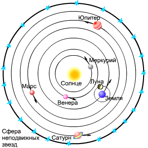
* Центральное светило: Солнце (Sol) занимает положение в абсолютном центре Вселенной и является полностью неподвижным. Коперник описывал его как «лампу», которая освещает весь космос из единой точки.
* Статус и движения Земли: Земля лишается статуса центра мира и превращается в обычную планету, закрепленную на третьей концентрической сфере. Коперник наделил Землю тремя движениями:
1. Суточное вращение: вокруг своей оси с запада на восток (что объясняет видимый восход и заход звезд).
   1. Годичное обращение: вокруг Солнца по круговой орбите.
   2. Девиация (коническое движение): медленное вращение земной оси для сохранения ее постоянного наклона в пространстве.
* Сфера Луны: Луна перестает быть самостоятельной планетой. Она закреплена на малой сфере, центр которой привязан к Земле, и обращается вокруг нее, увлекаясь вслед за Землей по общей околосолнечной орбите.
* Сфера неподвижных звезд: Самая внешняя сфера становится абсолютно статичной (в отличие от модели Птолемея, где она вращалась со скоростью один оборот в сутки). Видимое движение звезд теперь признается оптической иллюзией, вызванной вращением самой Земли. Размеры этой сферы были колоссально увеличены, чтобы объяснить отсутствие видимого смещения звезд (параллакса).
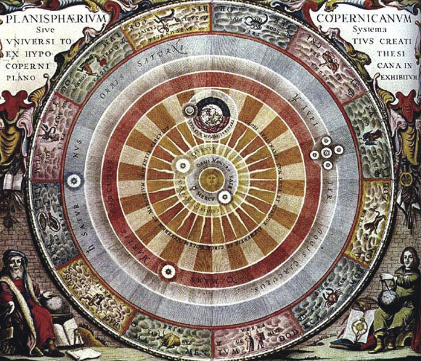
* Центральное светило: Солнце (Sol) занимает положение в абсолютном центре Вселенной и является полностью неподвижным. Коперник описывал его как «лампу», которая освещает весь космос из единой точки.
* Статус и движения Земли: Земля лишается статуса центра мира и превращается в обычную планету, закрепленную на третьей концентрической сфере. Коперник наделил Землю тремя движениями:
1. Суточное вращение: вокруг своей оси с запада на восток (что объясняет видимый восход и заход звезд).
   1. Годичное обращение: вокруг Солнца по круговой орбите.
   2. Девиация (коническое движение): медленное вращение земной оси для сохранения ее постоянного наклона в пространстве.
* Сфера Луны: Луна перестает быть самостоятельной планетой. Она закреплена на малой сфере, центр которой привязан к Земле, и обращается вокруг нее, увлекаясь вслед за Землей по общей околосолнечной орбите.
* Сфера неподвижных звезд: Самая внешняя сфера становится абсолютно статичной (в отличие от модели Птолемея, где она вращалась со скоростью один оборот в сутки). Видимое движение звезд теперь признается оптической иллюзией, вызванной вращением самой Земли. Размеры этой сферы были колоссально увеличены, чтобы объяснить отсутствие видимого смещения звезд (параллакса).

---

### title
*Динамическая космология Исаака Ньютона *
### body
> Космос стал бесконечным трехмерным пространством, где движение любых объектов — от падающего яблока до вращающихся планет — подчиняется единым математическим законам гравитации.
### notes
*Динамическая космология Исаака Ньютона сформулирована в 1687 году в труде «Математические начала натуральной философии»*

### article

Динамическая космология Исаака Ньютона (сформулированная в 1687 году в труде «Математические начала натуральной философии») окончательно устранила необходимость в геометрических сферах, эпициклах или выделенных центрах мира.
Ньютон заменил кинематические описания (как движутся тела) динамическими законами (почему они движутся). Космос стал бесконечным трехмерным пространством, где движение любых объектов — от падающего яблока до вращающихся планет — подчиняется единым математическим законам гравитации.

* Абсолютное пространство и время: Вселенная больше не имеет физических границ (таких как сфера неподвижных звезд). Пространство бесконечно, однородно (одинаково во всех точках) и изотропно (одинаково во всех направлениях). Оно служит неизменной «сценой» для движения материи. Время течет одинаково во всей Вселенной и не зависит от объектов внутри нее.
* Закон всемирного тяготения: Все материальные тела во Вселенной притягивают друг друга с силой, прямо пропорциональной произведению их масс и обратно пропорциональной квадрату расстояния между ними:
$$F = G \frac{m_1 m_2}{r^2}$$ 
* Механика орбитального движения: Планеты движутся по эллиптическим орбитам (описанным Кеплером) не из-за жестких хрустальных сфер или «космического ветра», а в результате баланса двух физических факторов:
1. Инерция: стремление планеты двигаться прямолинейно с постоянной скоростью в пустоте (1-й закон Ньютона).
   1. Гравитация: постоянное притягивающее усилие со стороны массивного Солнца, которое непрерывно отклоняет траекторию планеты от прямой линии, заставляя её «падать» вокруг светила по замкнутой кривой.
* Барицентр вместо жесткого центра: Строго говоря, в модели Ньютона планеты вращаются не вокруг геометрического центра Солнца, а вокруг общего центра масс (барицентра) всей Солнечной системы. Поскольку масса Солнца несоизмеримо больше массы всех планет, этот барицентр находится близко к центру Солнца, но постоянно слегка смещается.
* Проблема гравитационного коллапса: Ньютон понимал, что если все тела притягиваются, то в конечной Вселенной они со временем неизбежно стянутся в одну точку. Чтобы объяснить стабильность космоса, он постулировал, что Вселенная бесконечна и заполнена бесконечным количеством звезд: силы притяжения со всех сторон уравновешивают друг друга, не позволяя миру схлопнуться.

### images
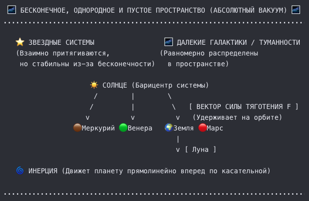
* Абсолютное пространство и время: Вселенная больше не имеет физических границ (таких как сфера неподвижных звезд). Пространство бесконечно, однородно (одинаково во всех точках) и изотропно (одинаково во всех направлениях). Оно служит неизменной «сценой» для движения материи. Время течет одинаково во всей Вселенной и не зависит от объектов внутри нее.
* Закон всемирного тяготения: Все материальные тела во Вселенной притягивают друг друга с силой, прямо пропорциональной произведению их масс и обратно пропорциональной квадрату расстояния между ними:
$$F = G \frac{m_1 m_2}{r^2}$$ 
* Механика орбитального движения: Планеты движутся по эллиптическим орбитам (описанным Кеплером) не из-за жестких хрустальных сфер или «космического ветра», а в результате баланса двух физических факторов:
1. Инерция: стремление планеты двигаться прямолинейно с постоянной скоростью в пустоте (1-й закон Ньютона).
   1. Гравитация: постоянное притягивающее усилие со стороны массивного Солнца, которое непрерывно отклоняет траекторию планеты от прямой линии, заставляя её «падать» вокруг светила по замкнутой кривой.
* Барицентр вместо жесткого центра: Строго говоря, в модели Ньютона планеты вращаются не вокруг геометрического центра Солнца, а вокруг общего центра масс (барицентра) всей Солнечной системы. Поскольку масса Солнца несоизмеримо больше массы всех планет, этот барицентр находится близко к центру Солнца, но постоянно слегка смещается.
* Проблема гравитационного коллапса: Ньютон понимал, что если все тела притягиваются, то в конечной Вселенной они со временем неизбежно стянутся в одну точку. Чтобы объяснить стабильность космоса, он постулировал, что Вселенная бесконечна и заполнена бесконечным количеством звезд: силы притяжения со всех сторон уравновешивают друг друга, не позволяя миру схлопнуться.

---

### title
*Скандинавия: мировое дерево Иггдрасиль*
### body
> Девять миров расположены на трёх уровнях. Ось мира — ясень Иггдрасиль. Мидгард (мир людей) — плоский диск, окружённый мировым океаном со змеем Ёрмунгандом. Небо — череп великана Имира, поддерживаемый четырьмя карликами.
### notes
*Верхний уровень: Асгард (боги) и Альвхейм. Средний: Мидгард, Ванахейм, Ётунхейм. Нижний: Хельхейм (мёртвые) и Свартальвхейм (цверги).*
### search
Yggdrasil nine worlds Norse cosmology

### article

Космология древних скандинавов, зафиксированная в текстах «Старшей» и «Младшей Эдды», представляет собой мифологическую био-модель Вселенной. В отличие от средиземноморских геометрических систем (сфер и дисков), скандинавский космос организован вокруг органического центра — гигантского ясеня Иггдрасиль (Yggdrasill), Мирового Древа, которое соединяет, питает и удерживает девять автономных миров.

## Девять миров скандинавского космоса
Вселенная жестко разделена по вертикали и горизонтали на три основных уровня, на которых распределены 9 обитаемых миров.
## 🌌 Верхний ярус (Крона Древа)

   1. Асгард (Ásgarðr) — небесный город, защищенный массивной стеной, где живут боги-асы (Один, Тор, Тюр). Здесь расположены их чертоги, включая Вальхаллу (зал павших воинов).
   2. Ванахейм (Vanaheimr) — мир богов-ванов, олицетворяющих силы природы, плодородия и магии (Ньёрд, Фрейр, Фрейя). Находится к западу от Асгарда.
   3. Альвхейм / Лёсальвхейм (Álfheimr) — обитель светлых альвов (эльфов), существ воздуха и света. Правителем этого мира в «Эдде» назван бог Фрейр.

## 🌿 Средний ярус (Ствол и ветви)

   1. Мидгард (Miðgarðr) — «срединная земля», сотворенная богами из тела первовеликана Имира. Это физический мир людей. Мидгард представляет собой круглый остров, окруженный глубоким мировым океаном.
   2. Ётунхейм (Jötunheimr) — каменистая и ледяная земля на востоке, за пределами обитаемого мира людей. Обитель инеистых великанов (ётунов), олицетворяющих разрушительные силы дикой природы. Главная крепость великанов называется Утгард.
   3. Свартальвхейм / Нидавеллир (Svartálfaheimr) — подземный мир, прорезанный пещерами и лабиринтами. Здесь живут цверги (дварфы/темные эльфы) — искусные кузнецы и мастера, создающие магическое оружие богов.

## 🪓 Нижний ярус (Корни Древа и бездны)

   1. Нифльхейм (Niflheimr) — мир предвечного льда, холода и ядовитых туманов, существовавший еще до сотворения обитаемой Вселенной. В его центре бурлит источник Хвергельмир («Кипящий котел»), откуда вытекают космические реки.
   2. Муспельхейм (Múspellsheimr) — мир вечного огня, жара и света, расположенный на южном полюсе космоса. Он также существовал до сотворения мира. Охраняется огненным великаном Суртом, чей пылающий меч уничтожит мир во время Рагнарёка.
   3. Хельхейм (Helheimr) — мрачное и холодное подземное царство мертвых, куда попадают люди, умершие от старости, болезней или несчастных случаев (не в бою). Миром правит великанша Хель. Путь туда ведет через реку Гьёлль по золотому мосту.

## Архитектура и фауна Мирового Древа

Иггдрасиль выполняет функцию стержня, поддерживающего баланс сил. Он удерживается тремя гигантскими корнями, каждый из которых уходит к своему сакральному источнику:

* Источник Урд: находится в Асгарде. Возле него живут три норны (Урд, Верданди, Скульд) — богини судьбы, которые ежедневно поливают корни ясеня священной водой, чтобы древо не засохло.
* Источник Мимира: находится в Ётунхейме. Содержит воду величайшей мудрости. Один отдал свой правый глаз, чтобы сделать из него один глоток.
* Источник Хвергельмир: расположен в Нифльхейме, питает все мировые воды.

Космическая фауна (проводники динамики древа):

* Дракон Нидхёгг: живет у корней в Нифльхейме и непрерывно подтачивает их, стремясь обрушить Иггдрасиль.
* Орел: сидит на самой вершине кроны и обладает великой мудростью. Между его глаз сидит ястреб Ведрфёльнир.
* Белка Рататоск: непрерывно бегает вверх и вниз по стволу, перенося бранные слова и сплетни между орлом на вершине и драконом Нидхёггом, поддерживая их вражду.
* Четыре оленя (Даин, Двалин, Дунейр, Дюратрор): бегают по ветвям Иггдрасиля и объедают его молодую листву.

## Ключевая особенность: Цикличность и Космические Границы

* Ёрмунганд (Мировой Змей): Сын Локи, чудовищный змей, которого Один сбросил в океан, окружающий Мидгард. Змей вырос настолько, что опоясал всю Землю и укусил себя за хвост, выступая в роли живой границы человеческого мира.
* Биврёст: Пылающий трехцветный радужный мост, соединяющий мир людей (Мидгард) с небом (Асгардом). Его охраняет бог Хеймдалль. Мост обрушится, когда по нему во время финальной битвы поедут всадники Муспельхейма.
* Конечный характер: Скандинавский космос принципиально смертен. Модель запрограммирована на гибель в день Рагнарёка (Сумерек богов), когда чудовища вырвутся на свободу, миры сгорят от огня Сурта и погрузятся в океан, после чего обновленная Вселенная поднимется из вод заново.

### images
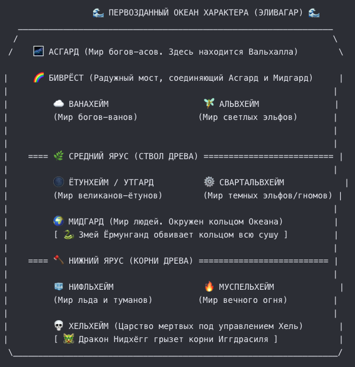
## 🌌 Верхний ярус (Крона Древа)

   1. Асгард (Ásgarðr) — небесный город, защищенный массивной стеной, где живут боги-асы (Один, Тор, Тюр). Здесь расположены их чертоги, включая Вальхаллу (зал павших воинов).
   2. Ванахейм (Vanaheimr) — мир богов-ванов, олицетворяющих силы природы, плодородия и магии (Ньёрд, Фрейр, Фрейя). Находится к западу от Асгарда.
   3. Альвхейм / Лёсальвхейм (Álfheimr) — обитель светлых альвов (эльфов), существ воздуха и света. Правителем этого мира в «Эдде» назван бог Фрейр.

## 🌿 Средний ярус (Ствол и ветви)

   1. Мидгард (Miðgarðr) — «срединная земля», сотворенная богами из тела первовеликана Имира. Это физический мир людей. Мидгард представляет собой круглый остров, окруженный глубоким мировым океаном.
   2. Ётунхейм (Jötunheimr) — каменистая и ледяная земля на востоке, за пределами обитаемого мира людей. Обитель инеистых великанов (ётунов), олицетворяющих разрушительные силы дикой природы. Главная крепость великанов называется Утгард.
   3. Свартальвхейм / Нидавеллир (Svartálfaheimr) — подземный мир, прорезанный пещерами и лабиринтами. Здесь живут цверги (дварфы/темные эльфы) — искусные кузнецы и мастера, создающие магическое оружие богов.

## 🪓 Нижний ярус (Корни Древа и бездны)

   1. Нифльхейм (Niflheimr) — мир предвечного льда, холода и ядовитых туманов, существовавший еще до сотворения обитаемой Вселенной. В его центре бурлит источник Хвергельмир («Кипящий котел»), откуда вытекают космические реки.
   2. Муспельхейм (Múspellsheimr) — мир вечного огня, жара и света, расположенный на южном полюсе космоса. Он также существовал до сотворения мира. Охраняется огненным великаном Суртом, чей пылающий меч уничтожит мир во время Рагнарёка.
   3. Хельхейм (Helheimr) — мрачное и холодное подземное царство мертвых, куда попадают люди, умершие от старости, болезней или несчастных случаев (не в бою). Миром правит великанша Хель. Путь туда ведет через реку Гьёлль по золотому мосту.

## 🌌 Верхний ярус (Крона Древа)

   1. Асгард (Ásgarðr) — небесный город, защищенный массивной стеной, где живут боги-асы (Один, Тор, Тюр). Здесь расположены их чертоги, включая Вальхаллу (зал павших воинов).
   2. Ванахейм (Vanaheimr) — мир богов-ванов, олицетворяющих силы природы, плодородия и магии (Ньёрд, Фрейр, Фрейя). Находится к западу от Асгарда.
   3. Альвхейм / Лёсальвхейм (Álfheimr) — обитель светлых альвов (эльфов), существ воздуха и света. Правителем этого мира в «Эдде» назван бог Фрейр.

## 🌿 Средний ярус (Ствол и ветви)

   1. Мидгард (Miðgarðr) — «срединная земля», сотворенная богами из тела первовеликана Имира. Это физический мир людей. Мидгард представляет собой круглый остров, окруженный глубоким мировым океаном.
   2. Ётунхейм (Jötunheimr) — каменистая и ледяная земля на востоке, за пределами обитаемого мира людей. Обитель инеистых великанов (ётунов), олицетворяющих разрушительные силы дикой природы. Главная крепость великанов называется Утгард.
   3. Свартальвхейм / Нидавеллир (Svartálfaheimr) — подземный мир, прорезанный пещерами и лабиринтами. Здесь живут цверги (дварфы/темные эльфы) — искусные кузнецы и мастера, создающие магическое оружие богов.

## 🪓 Нижний ярус (Корни Древа и бездны)

   1. Нифльхейм (Niflheimr) — мир предвечного льда, холода и ядовитых туманов, существовавший еще до сотворения обитаемой Вселенной. В его центре бурлит источник Хвергельмир («Кипящий котел»), откуда вытекают космические реки.
   2. Муспельхейм (Múspellsheimr) — мир вечного огня, жара и света, расположенный на южном полюсе космоса. Он также существовал до сотворения мира. Охраняется огненным великаном Суртом, чей пылающий меч уничтожит мир во время Рагнарёка.
   3. Хельхейм (Helheimr) — мрачное и холодное подземное царство мертвых, куда попадают люди, умершие от старости, болезней или несчастных случаев (не в бою). Миром правит великанша Хель. Путь туда ведет через реку Гьёлль по золотому мосту.

## 🌌 Верхний ярус (Крона Древа)

   1. Асгард (Ásgarðr) — небесный город, защищенный массивной стеной, где живут боги-асы (Один, Тор, Тюр). Здесь расположены их чертоги, включая Вальхаллу (зал павших воинов).
   2. Ванахейм (Vanaheimr) — мир богов-ванов, олицетворяющих силы природы, плодородия и магии (Ньёрд, Фрейр, Фрейя). Находится к западу от Асгарда.
   3. Альвхейм / Лёсальвхейм (Álfheimr) — обитель светлых альвов (эльфов), существ воздуха и света. Правителем этого мира в «Эдде» назван бог Фрейр.

## 🌿 Средний ярус (Ствол и ветви)

   1. Мидгард (Miðgarðr) — «срединная земля», сотворенная богами из тела первовеликана Имира. Это физический мир людей. Мидгард представляет собой круглый остров, окруженный глубоким мировым океаном.
   2. Ётунхейм (Jötunheimr) — каменистая и ледяная земля на востоке, за пределами обитаемого мира людей. Обитель инеистых великанов (ётунов), олицетворяющих разрушительные силы дикой природы. Главная крепость великанов называется Утгард.
   3. Свартальвхейм / Нидавеллир (Svartálfaheimr) — подземный мир, прорезанный пещерами и лабиринтами. Здесь живут цверги (дварфы/темные эльфы) — искусные кузнецы и мастера, создающие магическое оружие богов.

## 🪓 Нижний ярус (Корни Древа и бездны)

   1. Нифльхейм (Niflheimr) — мир предвечного льда, холода и ядовитых туманов, существовавший еще до сотворения обитаемой Вселенной. В его центре бурлит источник Хвергельмир («Кипящий котел»), откуда вытекают космические реки.
   2. Муспельхейм (Múspellsheimr) — мир вечного огня, жара и света, расположенный на южном полюсе космоса. Он также существовал до сотворения мира. Охраняется огненным великаном Суртом, чей пылающий меч уничтожит мир во время Рагнарёка.
   3. Хельхейм (Helheimr) — мрачное и холодное подземное царство мертвых, куда попадают люди, умершие от старости, болезней или несчастных случаев (не в бою). Миром правит великанша Хель. Путь туда ведет через реку Гьёлль по золотому мосту.
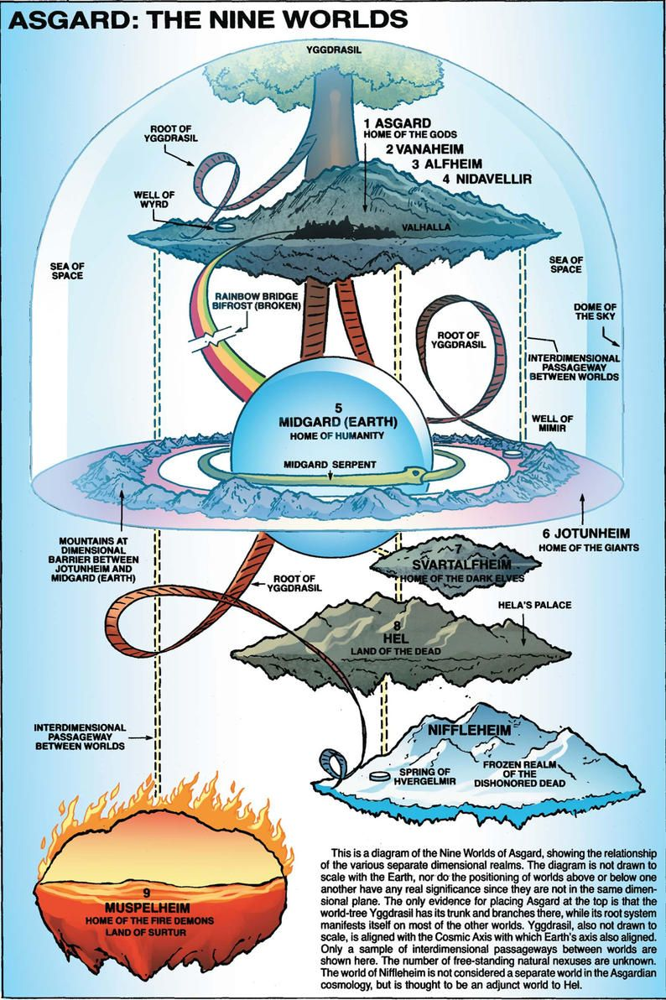
## 🌌 Верхний ярус (Крона Древа)

   1. Асгард (Ásgarðr) — небесный город, защищенный массивной стеной, где живут боги-асы (Один, Тор, Тюр). Здесь расположены их чертоги, включая Вальхаллу (зал павших воинов).
   2. Ванахейм (Vanaheimr) — мир богов-ванов, олицетворяющих силы природы, плодородия и магии (Ньёрд, Фрейр, Фрейя). Находится к западу от Асгарда.
   3. Альвхейм / Лёсальвхейм (Álfheimr) — обитель светлых альвов (эльфов), существ воздуха и света. Правителем этого мира в «Эдде» назван бог Фрейр.

## 🌿 Средний ярус (Ствол и ветви)

   1. Мидгард (Miðgarðr) — «срединная земля», сотворенная богами из тела первовеликана Имира. Это физический мир людей. Мидгард представляет собой круглый остров, окруженный глубоким мировым океаном.
   2. Ётунхейм (Jötunheimr) — каменистая и ледяная земля на востоке, за пределами обитаемого мира людей. Обитель инеистых великанов (ётунов), олицетворяющих разрушительные силы дикой природы. Главная крепость великанов называется Утгард.
   3. Свартальвхейм / Нидавеллир (Svartálfaheimr) — подземный мир, прорезанный пещерами и лабиринтами. Здесь живут цверги (дварфы/темные эльфы) — искусные кузнецы и мастера, создающие магическое оружие богов.

## 🪓 Нижний ярус (Корни Древа и бездны)

   1. Нифльхейм (Niflheimr) — мир предвечного льда, холода и ядовитых туманов, существовавший еще до сотворения обитаемой Вселенной. В его центре бурлит источник Хвергельмир («Кипящий котел»), откуда вытекают космические реки.
   2. Муспельхейм (Múspellsheimr) — мир вечного огня, жара и света, расположенный на южном полюсе космоса. Он также существовал до сотворения мира. Охраняется огненным великаном Суртом, чей пылающий меч уничтожит мир во время Рагнарёка.
   3. Хельхейм (Helheimr) — мрачное и холодное подземное царство мертвых, куда попадают люди, умершие от старости, болезней или несчастных случаев (не в бою). Миром правит великанша Хель. Путь туда ведет через реку Гьёлль по золотому мосту.
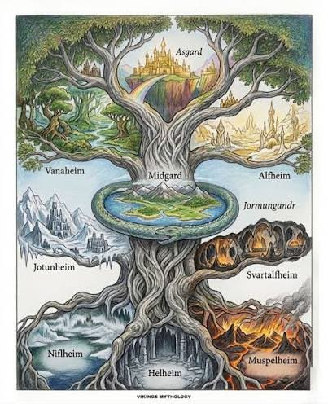
## 🌌 Верхний ярус (Крона Древа)

   1. Асгард (Ásgarðr) — небесный город, защищенный массивной стеной, где живут боги-асы (Один, Тор, Тюр). Здесь расположены их чертоги, включая Вальхаллу (зал павших воинов).
   2. Ванахейм (Vanaheimr) — мир богов-ванов, олицетворяющих силы природы, плодородия и магии (Ньёрд, Фрейр, Фрейя). Находится к западу от Асгарда.
   3. Альвхейм / Лёсальвхейм (Álfheimr) — обитель светлых альвов (эльфов), существ воздуха и света. Правителем этого мира в «Эдде» назван бог Фрейр.

## 🌿 Средний ярус (Ствол и ветви)

   1. Мидгард (Miðgarðr) — «срединная земля», сотворенная богами из тела первовеликана Имира. Это физический мир людей. Мидгард представляет собой круглый остров, окруженный глубоким мировым океаном.
   2. Ётунхейм (Jötunheimr) — каменистая и ледяная земля на востоке, за пределами обитаемого мира людей. Обитель инеистых великанов (ётунов), олицетворяющих разрушительные силы дикой природы. Главная крепость великанов называется Утгард.
   3. Свартальвхейм / Нидавеллир (Svartálfaheimr) — подземный мир, прорезанный пещерами и лабиринтами. Здесь живут цверги (дварфы/темные эльфы) — искусные кузнецы и мастера, создающие магическое оружие богов.

## 🪓 Нижний ярус (Корни Древа и бездны)

   1. Нифльхейм (Niflheimr) — мир предвечного льда, холода и ядовитых туманов, существовавший еще до сотворения обитаемой Вселенной. В его центре бурлит источник Хвергельмир («Кипящий котел»), откуда вытекают космические реки.
   2. Муспельхейм (Múspellsheimr) — мир вечного огня, жара и света, расположенный на южном полюсе космоса. Он также существовал до сотворения мира. Охраняется огненным великаном Суртом, чей пылающий меч уничтожит мир во время Рагнарёка.
   3. Хельхейм (Helheimr) — мрачное и холодное подземное царство мертвых, куда попадают люди, умершие от старости, болезней или несчастных случаев (не в бою). Миром правит великанша Хель. Путь туда ведет через реку Гьёлль по золотому мосту.
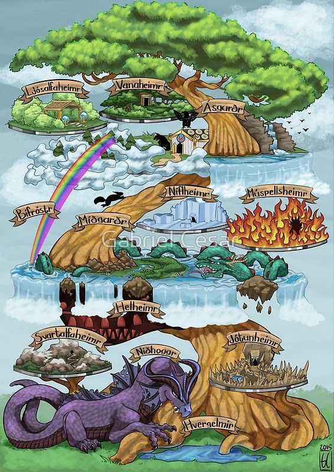
## 🌌 Верхний ярус (Крона Древа)

   1. Асгард (Ásgarðr) — небесный город, защищенный массивной стеной, где живут боги-асы (Один, Тор, Тюр). Здесь расположены их чертоги, включая Вальхаллу (зал павших воинов).
   2. Ванахейм (Vanaheimr) — мир богов-ванов, олицетворяющих силы природы, плодородия и магии (Ньёрд, Фрейр, Фрейя). Находится к западу от Асгарда.
   3. Альвхейм / Лёсальвхейм (Álfheimr) — обитель светлых альвов (эльфов), существ воздуха и света. Правителем этого мира в «Эдде» назван бог Фрейр.

## 🌿 Средний ярус (Ствол и ветви)

   1. Мидгард (Miðgarðr) — «срединная земля», сотворенная богами из тела первовеликана Имира. Это физический мир людей. Мидгард представляет собой круглый остров, окруженный глубоким мировым океаном.
   2. Ётунхейм (Jötunheimr) — каменистая и ледяная земля на востоке, за пределами обитаемого мира людей. Обитель инеистых великанов (ётунов), олицетворяющих разрушительные силы дикой природы. Главная крепость великанов называется Утгард.
   3. Свартальвхейм / Нидавеллир (Svartálfaheimr) — подземный мир, прорезанный пещерами и лабиринтами. Здесь живут цверги (дварфы/темные эльфы) — искусные кузнецы и мастера, создающие магическое оружие богов.

## 🪓 Нижний ярус (Корни Древа и бездны)

   1. Нифльхейм (Niflheimr) — мир предвечного льда, холода и ядовитых туманов, существовавший еще до сотворения обитаемой Вселенной. В его центре бурлит источник Хвергельмир («Кипящий котел»), откуда вытекают космические реки.
   2. Муспельхейм (Múspellsheimr) — мир вечного огня, жара и света, расположенный на южном полюсе космоса. Он также существовал до сотворения мира. Охраняется огненным великаном Суртом, чей пылающий меч уничтожит мир во время Рагнарёка.
   3. Хельхейм (Helheimr) — мрачное и холодное подземное царство мертвых, куда попадают люди, умершие от старости, болезней или несчастных случаев (не в бою). Миром правит великанша Хель. Путь туда ведет через реку Гьёлль по золотому мосту.
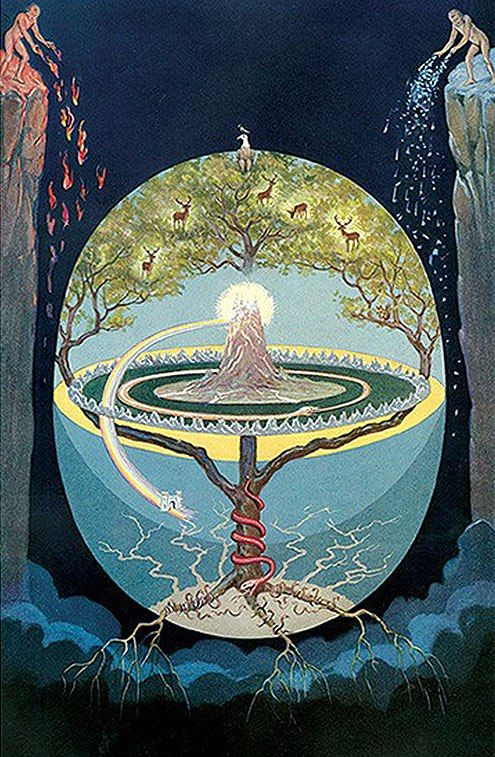
## 🌌 Верхний ярус (Крона Древа)

   1. Асгард (Ásgarðr) — небесный город, защищенный массивной стеной, где живут боги-асы (Один, Тор, Тюр). Здесь расположены их чертоги, включая Вальхаллу (зал павших воинов).
   2. Ванахейм (Vanaheimr) — мир богов-ванов, олицетворяющих силы природы, плодородия и магии (Ньёрд, Фрейр, Фрейя). Находится к западу от Асгарда.
   3. Альвхейм / Лёсальвхейм (Álfheimr) — обитель светлых альвов (эльфов), существ воздуха и света. Правителем этого мира в «Эдде» назван бог Фрейр.

## 🌿 Средний ярус (Ствол и ветви)

   1. Мидгард (Miðgarðr) — «срединная земля», сотворенная богами из тела первовеликана Имира. Это физический мир людей. Мидгард представляет собой круглый остров, окруженный глубоким мировым океаном.
   2. Ётунхейм (Jötunheimr) — каменистая и ледяная земля на востоке, за пределами обитаемого мира людей. Обитель инеистых великанов (ётунов), олицетворяющих разрушительные силы дикой природы. Главная крепость великанов называется Утгард.
   3. Свартальвхейм / Нидавеллир (Svartálfaheimr) — подземный мир, прорезанный пещерами и лабиринтами. Здесь живут цверги (дварфы/темные эльфы) — искусные кузнецы и мастера, создающие магическое оружие богов.

## 🪓 Нижний ярус (Корни Древа и бездны)

   1. Нифльхейм (Niflheimr) — мир предвечного льда, холода и ядовитых туманов, существовавший еще до сотворения обитаемой Вселенной. В его центре бурлит источник Хвергельмир («Кипящий котел»), откуда вытекают космические реки.
   2. Муспельхейм (Múspellsheimr) — мир вечного огня, жара и света, расположенный на южном полюсе космоса. Он также существовал до сотворения мира. Охраняется огненным великаном Суртом, чей пылающий меч уничтожит мир во время Рагнарёка.
   3. Хельхейм (Helheimr) — мрачное и холодное подземное царство мертвых, куда попадают люди, умершие от старости, болезней или несчастных случаев (не в бою). Миром правит великанша Хель. Путь туда ведет через реку Гьёлль по золотому мосту.
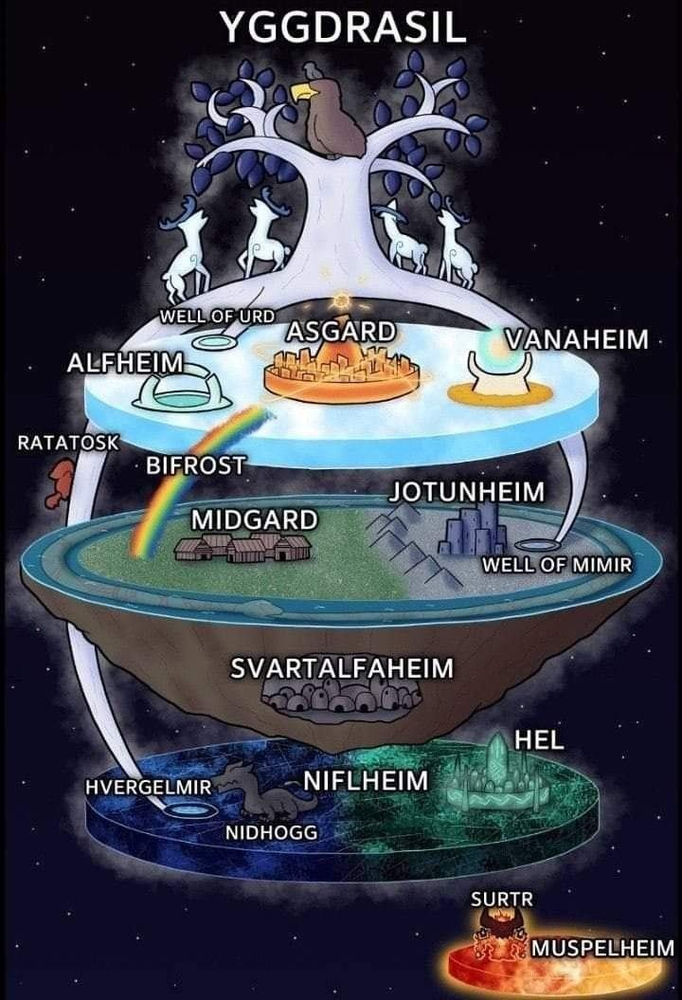

---

### title
*Славянской космогонии*
### body
> Нет жёсткой границы между небом и землёй. Пространство пронизано линиями песен (дорожками предков). Звёзды — живые существа (например, Пояс Ориона — группа рыбаков). Млечный Путь — река или дорога духов.
### notes
*Эта космология неразрывно связана с мифологией «времени сновидений» (Dreamtime).*
### search
Aboriginal songlines star dreaming painting

### article
Изначальный раскол мира на Верхние и Нижние Миры связывают с образами Белобога и Чернобога. Эти образы являются отражением первичных божеств. Белобог – бог солнца, рождения, чистоты и достатка. Чернобог – бог земли и защиты. Летел Чернобог кречетом, а Белобог соколом. Кречет нес в клюве землю, уронил ее и ушел вниз, да там и прижился. Сокол же нес семечко пшеницы, уронил его в землю, а сам остался наверху. Так и разделился мир на Нижний и Верхний, а из семечка вырос Дуб – Древо Жизни, опора и центр славянского мира. Стоит Дуб в нашем мире, корнями уходит в Нижние Миры, а ветвями – в Верхние Миры.

Важно понимать, что в делении на Верхние и Нижние Миры нет противопоставления зла и добра. У каждого мира – свое предназначение. Нижние Миры поддерживают стабильность и дают силу, а в Верхних Мирах происходит смена законов и порядка. При этом и Нижние, и Верхние Миры влияют на Срединный Мир между ними.

Космология славян представляет собой четкую, геометрически выверенную трехчастную систему бытия, завязанную на три фундаментальные субстанции: Правь, Явь и Навь [1]. Часто эта модель визуализируется как монолитное Мировое Древо или Космическое Колесо (Коловрат).

## Подробное описание трех миров современной модели
Вселенная держится на балансе трех сил, где Явь находится посередине, а Правь и Навь выступают верхним и нижним полюсами.
## 🌌 1. Правь — Мир Высшего Закона и Богов
Верхний Мир называется Правь. Ветви Дуба поддерживают небеса, выкованные богом Сварогом. Правь также состоит из девяти миров. Во-первых, это три уровня Железного неба – Мира Предков. Именно туда уходят после смерти наши предки и оттуда помогают потомкам.

Поселения предков располагаются в Ирии – ближнем к Яви мире. Перед рождением человек приходит в Ирий, знакомится со своей судьбой и подписывает договор с Родом. В нем указано, как человек будет себя проявлять, а Род ему помогать. Договор заносится в Книгу Рода.

Чтобы человек мог родиться в нашем мире, его спускают сюда через колодец. Звезды в небе и есть колодцы, через которые люди попадают в наш мир. За Миром Предков идет Мир Богов, или Сварга. Начало Мира Богов составляют три уровня Серебряного Неба, а собственно Мир Богов – три уровня Золотого Неба.

Правь — это наивысший, небесный ярус Вселенной. Само слово происходит от понятий «править», «правильный», «правда».

* Функция: Это мир чистой мысли, идеальных законов и справедливости. Здесь формируются правила, по которым устроен весь остальной космос: движение солнца, смена времен года, законы человеческой морали.
* Обитатели: Высшие светлые боги — Род (первотворец), Сварог (небесный кузнец), Перун (хранитель справедливости) и Даждьбог (податель блага). Пространство Прави называется Сваргой.
* Символика: Абсолютный свет, золото, вершины гор и крона Мирового Древа.

## 🌍 2. Явь — Проявленный Мир Людей
Явь — это срединный, осязаемый мир. Слово происходит от понятий «явный», «являться», «наяву».

Срединный Мир, или Явь, – это наш мир. Он является производным от Нижнего Мира. В центре Яви находится Дуб – ось и основа нашего мира. Неудивительно, что именно дуб стал символическим центром мира, ведь это самое крепкое и большое дерево в той местности, где зародилась славянская магия.

У Дуба стоит белый Алатырь камень – основной Закон мира и его твердь. На нем проступают письмена, в которых отражено все, что есть в нашем мире. При перемещении по мирам славянским Алатырь камень помогает центрироваться. Возле него текут ручьи Живой и Мертвой воды. Живая вода поднимается в Верхние Миры золотой цепью. Она дает силу и наполнение. Мертвая вода стекает вниз, в мир болота. Она позволяет очиститься и убрать негатив.

От Дуба расходятся девять миров Срединного Мира: три светлых, три серых и три темных. Они доступны восприятию обычного человека. Светлые миры, или миры благости, ближе всего к Дубу. В них все хорошо, нет бед и проблем, там человек расслаблен. В серых мирах есть и хорошее, и плохое. А темные миры, что с самого края Яви, – это миры борьбы, жестокости, бед и войн. Соприкоснувшись с ними, человек может стать жестче.

В Срединном Мире живут люди и некоторые сущности – например, духи, лешие и бесы. Чем дальше миры от Дуба, тем больше духов обитает в них. Сказочный поход «за тридевять земель» как раз и означал путешествие к духам.

* Функция: Это мир физической материи, времени и пространства, в котором мы живем. Явь — это арена, где духовные законы Прави обретают плотную форму, а живые существа проходят земной опыт.
* Обитатели: Люди, животные, растения, а также духи-хранители природы, которые находятся на границе восприятия (домовые, лешие, водяные).
* Связь с другими мирами: Явь постоянно подпитывается энергией Прави (свет, тепло, законы) и Нави (скрытые силы земли, корни, магия). Человек в Яви должен стремиться «жить по Прави», чтобы после смерти его душа поднялась в высшие миры.

## 💀 3. Навь — Мир Тонких Сил и Предков

Перейдем теперь к Нижнему Миру. Его еще называют Навь. В Навь уходят корни Дуба, растущего в мире Яви. Навь также состоит из девяти миров, они уходят вниз. Ближе всего к нашему миру – мир болота, а за ним – мир чертей. Чертями называют все виды существ, живущих «за чертой», то есть за пределами нашего мира.

Мир болота очень значим для колдуна, так как именно в нем делается большая часть магической работы. Мы также будем основную работу выполнять либо в мире Яви, либо в мире болота. Ниже уходить не стоит, так как в самые нижние миры опасно спускаться без определенного навыка и опыта.

Важно знать и то, что некоторыми практиками Навь понимается не как Нижние Миры, а как океан, находящийся за первичным яйцом. Есть техники, работающие именно с Навью-океаном.

Навь — это нижний, скрытый или потусторонний мир. Название связывают со словом «навьи» (духи умерших).

* Функция: Мир непроявленного, подсознания, магии и сна. Навь не является аналогом абсолютного «ада» в христианском понимании; это необходимый фундамент Вселенной, место, откуда все зарождается и куда все возвращается. Это мир памяти, где хранятся знания предков.
* Обитатели: Души умерших людей (чуры, щюры, пращуры), а также божества, отвечающие за покой, зиму, магию и трансформацию — Велес (в роли проводника и хранителя перекрестков миров), Марена (богиня зимы и перехода) и Чернобог.
* Внутренняя структура: Часто Навь делят на Светлую Навь (Ирий) — благодатные луга, где отдыхают души достойных предков, и Темную Навь (Пекло) — глубокие очистительные ярусы для душ, совершивших тяжелые проступки в Яви.

## Главные концептуальные принципы модели

* Космическое яйцо Рода: Согласно космогоническому сюжету этой модели, изначально Вселенная спала внутри Космического Яйца, где пребывал бог Род. Своей волей он родил Любовь (Ладу) и разрушил скорлупу, сотворив Правь, Явь и Навь из осколков и разделив их.
* Мировое Древо как соединитель: Все три мира пронзает единая ось. Правь — это ветви и листья Древа, Явь — ствол, а Навь — корни. Шаманы, волхвы или боги могут перемещаться по стволу вверх и вниз.
* Взаимозависимость триады: Пространство устойчиво, пока все три элемента находятся в гармонии. Законы рождаются в Прави, воплощаются в Яви и растворяются, уходя в память и корни Нави, чтобы затем переродиться. Движение душ по этому кругу координируется понятием «Коло» (колесо времени).

### images
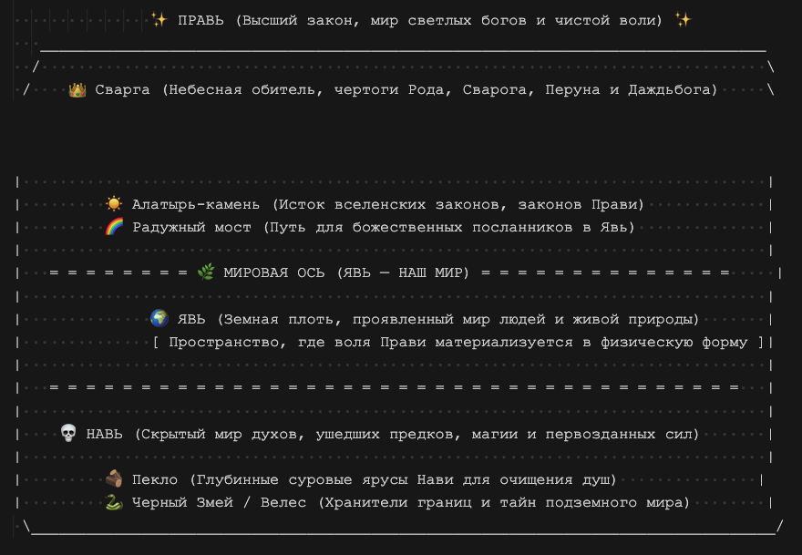
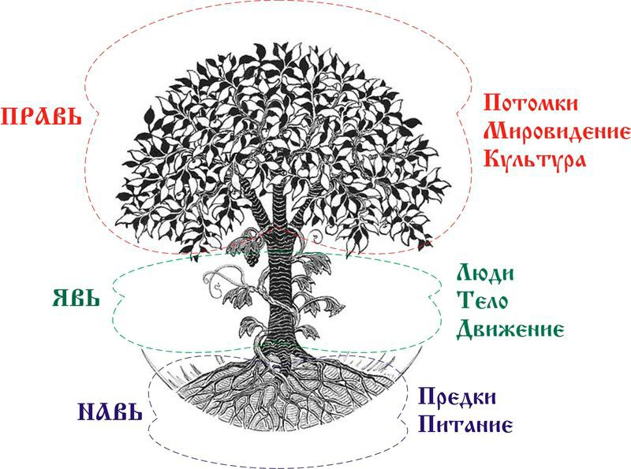
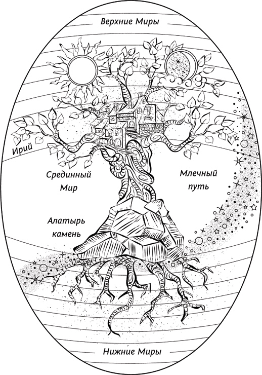
---

### title
*Ацтеки и Майя: квадратная земля и многослойное небо*
### body
> Земля — плоский квадрат, разделённый крестом на 4 стороны света (каждая — свой цвет и священное дерево). Над Землёй — 13 небесных слоёв, под Землёй — 9 подземных слоёв. Солнце проходит через 13 небес днём и 9 миров ночью.
### notes
*Камень Солнца ацтеков (календарь) изображает эту структуру: центральный диск с четырьмя предыдущими эпохами-солнцами.*
### search
Aztec cosmology 13 heavens 9 underworlds

### article
Космология ацтеков — это строгая пространственно-временная модель, в которой Вселенная одновременно разделена на 13 небесных уровней (вертикаль), 9 кругов подземного мира и 4 стороны света (горизонталь). Согласно кодексам Мезоамерики, космос ацтеков возник из тела чудовища Сипактли (Cipactli) и находится в состоянии постоянной нестабильности, требуя подпитки кровью для предотвращения гибели.  
Ниже приведена подробная пространственная схема ацтекского мироздания (Сем-Анауак — «весь мир, окруженный водой») и её детальное описание. 

## 1. Вертикаль: 13 небес (Топан)
Каждое небо ацтеков представляло собой самостоятельную твердь (ильуикатль), заселенную определенными сущностями: 

* 1–4 уровни (Ближний космос): Здесь формировались облака, дожди (небо Тлалокана), двигались Луна, звезды и Солнце.
* 5–7 уровни (Срединный космос): Область комет («блуждающих змей»), пути созвездия Большой Медведицы и зона, где рождался дневной и ночной свет.
* 8–12 уровни (Священные тверди): Место обитания стихийных богов. Небеса синих, белых и красных звезд, обители бога огня Шиутекутли и создателей человечества. На 12-м уровне боги непрерывно точили обсидиановые ножи.
* 13 уровень: Омейокан (Omeyocan): Абсолютная вершина Вселенной. Мир вечной тишины и чистой мысли, где обитает Ометеотль — двуединый бог/богиня (исток мужской и женской энергии). Омейокан находится выше движения планет и времени. 

## 2. Горизонталь: 4 направления и Ось мира
Ацтеки воспринимали обитаемую землю как плоский диск, радиально разделенный на 4 сектора. Каждая сторона имела жесткое символическое кодирование: 

* Восток (Tlahuiztlampa): Регион плодородия и возрождения. Цвет — зеленый/белый, покровитель — бог дождя Тлалок.
* Север (Mictlampa): Мир тьмы и зимы. Цвет — черный, покровитель — владыка ночи Тескатлипока.
* Запад (Cihuatlampa): Мир увядания, заката и магии. Цвет — красный, покровитель — пернатый змей Кецалькоатль.
* Юг (Huitztlampa): Регион войны и полуденного жара. Цвет — синий, покровитель — бог войны Уицилопочтли.
* Центр мира (Аксис Мунди): Точка схождения всех направлений и вертикальных слоев. В этой точке ацтеки построили свой главный храм [Templo Mayor](https://www.google.com/search?kgmid=/m/06c6tk) в столице Теночтитлан. Храм служил физическим замком, удерживающим небо и землю от сдвигов.  

## 3. Нижний мир: 9 кругов Миктлана
Для большинства умерших (кроме воинов и женщин, погибших при родах) путь в загробный мир лежал через Миктлан. Душа должна была пройти 9 уровней страданий за 4 года:  

   1. Ицкуинтлан: Переправа через подземную реку на спине собаки-проводника (Ксолоитцкуинтли).
   2. Тепеме Конамиктлан: Место, где две гигантские горы непрерывно сходятся и расходятся, грозя раздавить душу.
   3. Ицтепетль: Гора, сплошь покрытая острыми обсидиановыми лезвиями.
   4. Ицехекаян: Бездна, где дует ледяной ветер, режущий как ножи.
   5. Панкуэкуэлаканьян: Зона, где отсутствует гравитация, и души парят как флаги.
   6. Темиминалоян: Место, где невидимые руки непрерывно обстреливают путников стрелами.
   7. Тейоллокуалоян: Обитель диких ягуаров, которые вырывают и съедают человеческие сердца.
   8. Ицмиктлан Апокалоканьян: Мрачный тупик, где нужно преодолеть узкие ущелья в полной темноте.
   9. Чиконауамиктлан: Девятый, самый глубокий уровень. Обитель повелителя смерти Миктлантекутли и его жены Миктлансиуатль. Достигнув этого места, душа окончательно обретала покой и растворялась в небытии.  

## Ключевая временная концепция: Пять Солнц
Ацтекская модель циклична во времени. Пространство существует в рамках эпох — «Солнц»

* Четыре предыдущие эпохи были уничтожены космическими катастрофами (ягуарами, ураганами, огненным дождем и потопом).
* Ацтеки верили, что живут в эпохе Пятого Солнца (Науи Оллин), которая должна погибнуть от разрушительных землетрясений. Чтобы отсрочить этот финал и дать Солнцу энергию двигаться по небу, совершались ритуальные человеческие жертвоприношения — кровь считалась единственным священным топливом космоса.

## Космология майя
Космология майя во многом родственна ацтекской, но имеет принципиальные отличия в центральном стержне и биоморфных элементах. В то время как ацтеки делали упор на постоянный страх перед концом света и войну, картина мира майя строилась вокруг астрономических циклов времени, математического баланса и концепции Мирового Древа, связывающего 13 небес и 9 уровней подземного мира.  
Ниже приведена подробная пространственная схема мироздания майя и её детальное описание, реконструированные по священной книге «Пополь-Вух» и барельефам (например, на крышке саркофага царя Пакаля в Паленке).  

## 1. Вертикальная ось: Мировое Древо (Яшче / Сейба)
Главным организующим элементом космоса майя было Мировое Древо (обычно представляемое в виде священного дерева сейбы, Ceiba pentandra). Оно пронизывало всю Вселенную:  

* Корни: Уходили глубоко в подземный мир.
* Твол: Находился в срединном мире людей.
* Крона: Разветвлялась в небесах, выступая в роли физической опоры для небесного свода.  

Иногда вместо дерева майя изображали Исполинского Каймана (Крокодила), стоявшего вертикально; его шипастая шкура визуально имитировала колючий ствол молодой сейбы. 

## 2. Верхний мир: 13 небес
Небесная сфера разделена на 13 горизонтальных слоев, расположенных в форме ступенчатой пирамиды. Этой областью управлял совет из 13 божеств — Ошлахунтику (Oxlahuntikú).  

* Светила и Движение: Небо ассоциировалось с птицами и пернатыми змеями. Считалось, что небесные тела перемещаются по ярусам, подчиняясь строгим математическим формулам. Особое внимание майя уделяли циклу Венеры и Луны.
* Наивысший ярус: Место обитания верховного бога мудрости и неба — Ицамны. Здесь царил абсолютный покой.
* Посмертная участь: Сюда после смерти мгновенно отправлялись души воинов, жертв ритуальных игр в мяч и женщин, умерших во время родов. Остальные должны были пройти через Нижний мир.  

## 3. Срединный мир: Земная платформа

* Опора на воде: Земля представлялась майя плоским четырехугольным или круглым диском, который плавал в огромном водоеме, покрытом водяными лилиями (кувшинками). Этот диск покоился на спине исполинского каймана или космической черепахи.
* Бакабы (Стражи углов): По четырем углам Земли стояли четыре бога-титана — Бакабы. Они физически поддерживали небо руками, чтобы оно не рухнуло на землю. Каждый Бакаб соотносился со своим священным деревом сейбы, цветом и направлением:
* Восток: Чак-Шиб-Чаку (Красный)
   * Запад: Эк-Шиб-Чаку (Черный)
   * Север: Сак-Шиб-Чаку (Белый)
   * Юг: Кан-Шиб-Чаку (Желтый)
   * Центр: Яш-Че (Зеленый / Главная Сейба)

## 4. Нижний мир: 9 кругов Шибальбы
Шибальба (Xibalba — «Место страха») — это подземное царство, устроенное в виде перевернутой ступенчатой пирамиды из 9 ярусов. Им управляли 9 Владык Ночи — Болонтику. 

* Путь испытаний: Чтобы пройти Шибальбу, душа покойного (или герои-близнецы в «Пополь-Вух») должна была преодолеть смертельные ловушки: реки, наполненные кровью, грязью и скорпионами. На ложных перекрестках подземные дороги умели разговаривать, чтобы запутать путника.
* Дома испытаний: Внутри Шибальбы находились специализированные зоны пыток: Дом Тьмы (полное отсутствие света), Дом Холода (вечный лед), Дом Ягуаров (где голодные хищники рвали плоть), Дом Летучих мышей (где правил кровожадный Камазоц) и Дом Обсидиановых Ножей (где лезвия двигались сами по себе).
* Трансформация Солнца: Дневное Солнце (Кинич Ахау) на закате спускалось в Шибальбу, превращаясь в Ночного Ягуара. Оно сражалось с владыками смерти, проходя сквозь 9 кругов ада за ночь, чтобы утром снова взойти на востоке в своем сияющем облике. 

## Главные отличия: Майя vs Ацтеки

* Характер времени: У ацтеков мир уничтожался линейно и требовал постоянных массовых жертв для продления Пятого Солнца. У майя время понималось как бесконечная спираль великих циклов (Катунов и Бактунов) без начала и конца. Окончание одного цикла (как в знаменитом 2012 году) означало лишь автоматическую перезагрузку календаря и переход на новый виток, а не абсолютный хаос.
* Символизм: У ацтеков центр мира — это Теночтитлан (политический и рукотворный центр). У майя центр мира — это Яшче (природная Священная Сейба), дерево жизни, объединяющее флору, фауну, богов и людей в единую экосистему.  

### images
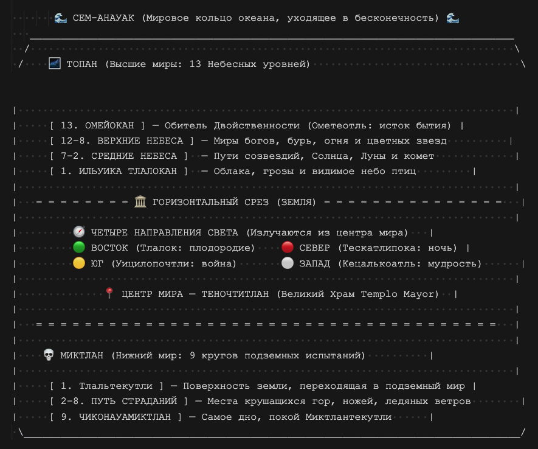
## 1. Вертикаль: 13 небес (Топан)
Каждое небо ацтеков представляло собой самостоятельную твердь (ильуикатль), заселенную определенными сущностями: 

* 1–4 уровни (Ближний космос): Здесь формировались облака, дожди (небо Тлалокана), двигались Луна, звезды и Солнце.
* 5–7 уровни (Срединный космос): Область комет («блуждающих змей»), пути созвездия Большой Медведицы и зона, где рождался дневной и ночной свет.
* 8–12 уровни (Священные тверди): Место обитания стихийных богов. Небеса синих, белых и красных звезд, обители бога огня Шиутекутли и создателей человечества. На 12-м уровне боги непрерывно точили обсидиановые ножи.
* 13 уровень: Омейокан (Omeyocan): Абсолютная вершина Вселенной. Мир вечной тишины и чистой мысли, где обитает Ометеотль — двуединый бог/богиня (исток мужской и женской энергии). Омейокан находится выше движения планет и времени. 

## 2. Горизонталь: 4 направления и Ось мира
Ацтеки воспринимали обитаемую землю как плоский диск, радиально разделенный на 4 сектора. Каждая сторона имела жесткое символическое кодирование: 

* Восток (Tlahuiztlampa): Регион плодородия и возрождения. Цвет — зеленый/белый, покровитель — бог дождя Тлалок.
* Север (Mictlampa): Мир тьмы и зимы. Цвет — черный, покровитель — владыка ночи Тескатлипока.
* Запад (Cihuatlampa): Мир увядания, заката и магии. Цвет — красный, покровитель — пернатый змей Кецалькоатль.
* Юг (Huitztlampa): Регион войны и полуденного жара. Цвет — синий, покровитель — бог войны Уицилопочтли.
* Центр мира (Аксис Мунди): Точка схождения всех направлений и вертикальных слоев. В этой точке ацтеки построили свой главный храм [Templo Mayor](https://www.google.com/search?kgmid=/m/06c6tk) в столице Теночтитлан. Храм служил физическим замком, удерживающим небо и землю от сдвигов. [1, 2, 6, 8] 

## 3. Нижний мир: 9 кругов Миктлана
Для большинства умерших (кроме воинов и женщин, погибших при родах) путь в загробный мир лежал через Миктлан. Душа должна была пройти 9 уровней страданий за 4 года: [1, 4] 

   1. Ицкуинтлан: Переправа через подземную реку на спине собаки-проводника (Ксолоитцкуинтли).
   2. Тепеме Конамиктлан: Место, где две гигантские горы непрерывно сходятся и расходятся, грозя раздавить душу.
   3. Ицтепетль: Гора, сплошь покрытая острыми обсидиановыми лезвиями.
   4. Ицехекаян: Бездна, где дует ледяной ветер, режущий как ножи.
   5. Панкуэкуэлаканьян: Зона, где отсутствует гравитация, и души парят как флаги.
   6. Темиминалоян: Место, где невидимые руки непрерывно обстреливают путников стрелами.
   7. Тейоллокуалоян: Обитель диких ягуаров, которые вырывают и съедают человеческие сердца.
   8. Ицмиктлан Апокалоканьян: Мрачный тупик, где нужно преодолеть узкие ущелья в полной темноте.
   9. Чиконауамиктлан: Девятый, самый глубокий уровень. Обитель повелителя смерти Миктлантекутли и его жены Миктлансиуатль. Достигнув этого места, душа окончательно обретала покой и растворялась в небытии. [1, 8]
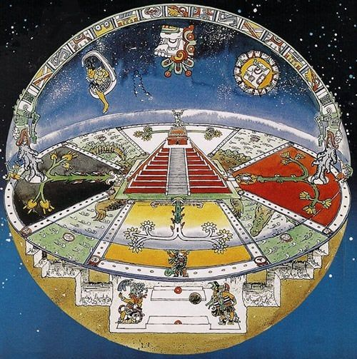
## 1. Вертикальная ось: Мировое Древо (Яшче / Сейба)
Главным организующим элементом космоса майя было Мировое Древо (обычно представляемое в виде священного дерева сейбы, Ceiba pentandra). Оно пронизывало всю Вселенную: [5, 6] 

* Корни: Уходили глубоко в подземный мир.
* Твол: Находился в срединном мире людей.
* Крона: Разветвлялась в небесах, выступая в роли физической опоры для небесного свода. [5, 7] 

Иногда вместо дерева майя изображали Исполинского Каймана (Крокодила), стоявшего вертикально; его шипастая шкура визуально имитировала колючий ствол молодой сейбы. [3, 7] 

## 2. Верхний мир: 13 небес
Небесная сфера разделена на 13 горизонтальных слоев, расположенных в форме ступенчатой пирамиды. Этой областью управлял совет из 13 божеств — Ошлахунтику (Oxlahuntikú). [1, 8] 

* Светила и Движение: Небо ассоциировалось с птицами и пернатыми змеями. Считалось, что небесные тела перемещаются по ярусам, подчиняясь строгим математическим формулам. Особое внимание майя уделяли циклу Венеры и Луны.
* Наивысший ярус: Место обитания верховного бога мудрости и неба — Ицамны. Здесь царил абсолютный покой.
* Посмертная участь: Сюда после смерти мгновенно отправлялись души воинов, жертв ритуальных игр в мяч и женщин, умерших во время родов. Остальные должны были пройти через Нижний мир. [2, 9, 10, 11] 

## 3. Срединный мир: Земная платформа

* Опора на воде: Земля представлялась майя плоским четырехугольным или круглым диском, который плавал в огромном водоеме, покрытом водяными лилиями (кувшинками). Этот диск покоился на спине исполинского каймана или космической черепахи.
* Бакабы (Стражи углов): По четырем углам Земли стояли четыре бога-титана — Бакабы. Они физически поддерживали небо руками, чтобы оно не рухнуло на землю. Каждый Бакаб соотносился со своим священным деревом сейбы, цветом и направлением:
* Восток: Чак-Шиб-Чаку (Красный)
   * Запад: Эк-Шиб-Чаку (Черный)
   * Север: Сак-Шиб-Чаку (Белый)
   * Юг: Кан-Шиб-Чаку (Желтый)
   * Центр: Яш-Че (Зеленый / Главная Сейба)

## 4. Нижний мир: 9 кругов Шибальбы
Шибальба (Xibalba — «Место страха») — это подземное царство, устроенное в виде перевернутой ступенчатой пирамиды из 9 ярусов. Им управляли 9 Владык Ночи — Болонтику. 

* Путь испытаний: Чтобы пройти Шибальбу, душа покойного (или герои-близнецы в «Пополь-Вух») должна была преодолеть смертельные ловушки: реки, наполненные кровью, грязью и скорпионами. На ложных перекрестках подземные дороги умели разговаривать, чтобы запутать путника.
* Дома испытаний: Внутри Шибальбы находились специализированные зоны пыток: Дом Тьмы (полное отсутствие света), Дом Холода (вечный лед), Дом Ягуаров (где голодные хищники рвали плоть), Дом Летучих мышей (где правил кровожадный Камазоц) и Дом Обсидиановых Ножей (где лезвия двигались сами по себе).
* Трансформация Солнца: Дневное Солнце (Кинич Ахау) на закате спускалось в Шибальбу, превращаясь в Ночного Ягуара. Оно сражалось с владыками смерти, проходя сквозь 9 кругов ада за ночь, чтобы утром снова взойти на востоке в своем сияющем облике. 
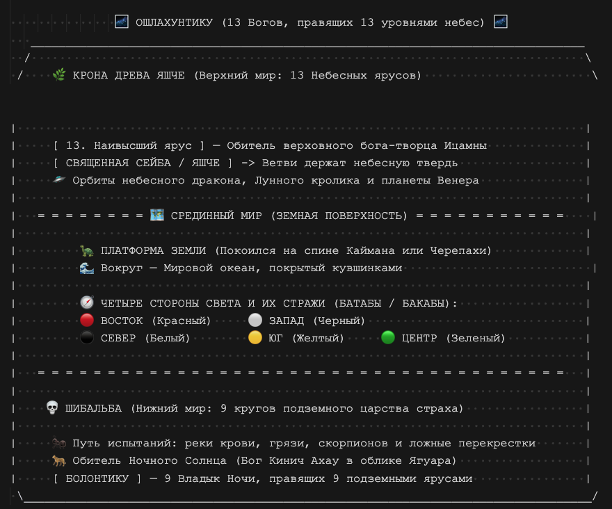
## 1. Вертикальная ось: Мировое Древо (Яшче / Сейба)
Главным организующим элементом космоса майя было Мировое Древо (обычно представляемое в виде священного дерева сейбы, Ceiba pentandra). Оно пронизывало всю Вселенную: [5, 6] 

* Корни: Уходили глубоко в подземный мир.
* Твол: Находился в срединном мире людей.
* Крона: Разветвлялась в небесах, выступая в роли физической опоры для небесного свода. [5, 7] 

Иногда вместо дерева майя изображали Исполинского Каймана (Крокодила), стоявшего вертикально; его шипастая шкура визуально имитировала колючий ствол молодой сейбы. [3, 7] 

## 2. Верхний мир: 13 небес
Небесная сфера разделена на 13 горизонтальных слоев, расположенных в форме ступенчатой пирамиды. Этой областью управлял совет из 13 божеств — Ошлахунтику (Oxlahuntikú). [1, 8] 

* Светила и Движение: Небо ассоциировалось с птицами и пернатыми змеями. Считалось, что небесные тела перемещаются по ярусам, подчиняясь строгим математическим формулам. Особое внимание майя уделяли циклу Венеры и Луны.
* Наивысший ярус: Место обитания верховного бога мудрости и неба — Ицамны. Здесь царил абсолютный покой.
* Посмертная участь: Сюда после смерти мгновенно отправлялись души воинов, жертв ритуальных игр в мяч и женщин, умерших во время родов. Остальные должны были пройти через Нижний мир. [2, 9, 10, 11] 

## 3. Срединный мир: Земная платформа

* Опора на воде: Земля представлялась майя плоским четырехугольным или круглым диском, который плавал в огромном водоеме, покрытом водяными лилиями (кувшинками). Этот диск покоился на спине исполинского каймана или космической черепахи.
* Бакабы (Стражи углов): По четырем углам Земли стояли четыре бога-титана — Бакабы. Они физически поддерживали небо руками, чтобы оно не рухнуло на землю. Каждый Бакаб соотносился со своим священным деревом сейбы, цветом и направлением:
* Восток: Чак-Шиб-Чаку (Красный)
   * Запад: Эк-Шиб-Чаку (Черный)
   * Север: Сак-Шиб-Чаку (Белый)
   * Юг: Кан-Шиб-Чаку (Желтый)
   * Центр: Яш-Че (Зеленый / Главная Сейба)

## 4. Нижний мир: 9 кругов Шибальбы
Шибальба (Xibalba — «Место страха») — это подземное царство, устроенное в виде перевернутой ступенчатой пирамиды из 9 ярусов. Им управляли 9 Владык Ночи — Болонтику. 

* Путь испытаний: Чтобы пройти Шибальбу, душа покойного (или герои-близнецы в «Пополь-Вух») должна была преодолеть смертельные ловушки: реки, наполненные кровью, грязью и скорпионами. На ложных перекрестках подземные дороги умели разговаривать, чтобы запутать путника.
* Дома испытаний: Внутри Шибальбы находились специализированные зоны пыток: Дом Тьмы (полное отсутствие света), Дом Холода (вечный лед), Дом Ягуаров (где голодные хищники рвали плоть), Дом Летучих мышей (где правил кровожадный Камазоц) и Дом Обсидиановых Ножей (где лезвия двигались сами по себе).
* Трансформация Солнца: Дневное Солнце (Кинич Ахау) на закате спускалось в Шибальбу, превращаясь в Ночного Ягуара. Оно сражалось с владыками смерти, проходя сквозь 9 кругов ада за ночь, чтобы утром снова взойти на востоке в своем сияющем облике. 
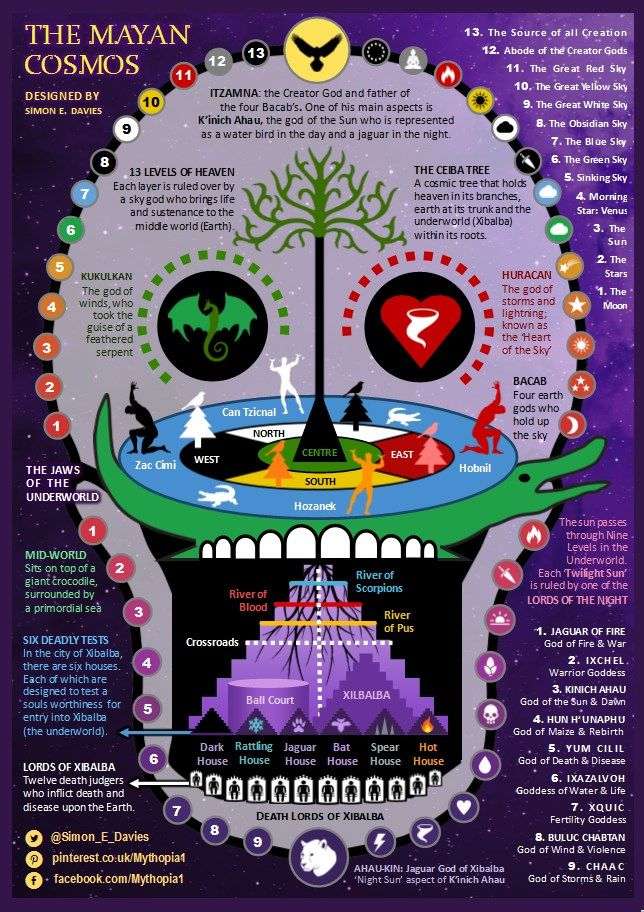
## 1. Вертикальная ось: Мировое Древо (Яшче / Сейба)
Главным организующим элементом космоса майя было Мировое Древо (обычно представляемое в виде священного дерева сейбы, Ceiba pentandra). Оно пронизывало всю Вселенную: [5, 6] 

* Корни: Уходили глубоко в подземный мир.
* Твол: Находился в срединном мире людей.
* Крона: Разветвлялась в небесах, выступая в роли физической опоры для небесного свода. [5, 7] 

Иногда вместо дерева майя изображали Исполинского Каймана (Крокодила), стоявшего вертикально; его шипастая шкура визуально имитировала колючий ствол молодой сейбы. [3, 7] 

## 2. Верхний мир: 13 небес
Небесная сфера разделена на 13 горизонтальных слоев, расположенных в форме ступенчатой пирамиды. Этой областью управлял совет из 13 божеств — Ошлахунтику (Oxlahuntikú). [1, 8] 

* Светила и Движение: Небо ассоциировалось с птицами и пернатыми змеями. Считалось, что небесные тела перемещаются по ярусам, подчиняясь строгим математическим формулам. Особое внимание майя уделяли циклу Венеры и Луны.
* Наивысший ярус: Место обитания верховного бога мудрости и неба — Ицамны. Здесь царил абсолютный покой.
* Посмертная участь: Сюда после смерти мгновенно отправлялись души воинов, жертв ритуальных игр в мяч и женщин, умерших во время родов. Остальные должны были пройти через Нижний мир. [2, 9, 10, 11] 

## 3. Срединный мир: Земная платформа

* Опора на воде: Земля представлялась майя плоским четырехугольным или круглым диском, который плавал в огромном водоеме, покрытом водяными лилиями (кувшинками). Этот диск покоился на спине исполинского каймана или космической черепахи.
* Бакабы (Стражи углов): По четырем углам Земли стояли четыре бога-титана — Бакабы. Они физически поддерживали небо руками, чтобы оно не рухнуло на землю. Каждый Бакаб соотносился со своим священным деревом сейбы, цветом и направлением:
* Восток: Чак-Шиб-Чаку (Красный)
   * Запад: Эк-Шиб-Чаку (Черный)
   * Север: Сак-Шиб-Чаку (Белый)
   * Юг: Кан-Шиб-Чаку (Желтый)
   * Центр: Яш-Че (Зеленый / Главная Сейба)

## 4. Нижний мир: 9 кругов Шибальбы
Шибальба (Xibalba — «Место страха») — это подземное царство, устроенное в виде перевернутой ступенчатой пирамиды из 9 ярусов. Им управляли 9 Владык Ночи — Болонтику. 

* Путь испытаний: Чтобы пройти Шибальбу, душа покойного (или герои-близнецы в «Пополь-Вух») должна была преодолеть смертельные ловушки: реки, наполненные кровью, грязью и скорпионами. На ложных перекрестках подземные дороги умели разговаривать, чтобы запутать путника.
* Дома испытаний: Внутри Шибальбы находились специализированные зоны пыток: Дом Тьмы (полное отсутствие света), Дом Холода (вечный лед), Дом Ягуаров (где голодные хищники рвали плоть), Дом Летучих мышей (где правил кровожадный Камазоц) и Дом Обсидиановых Ножей (где лезвия двигались сами по себе).
* Трансформация Солнца: Дневное Солнце (Кинич Ахау) на закате спускалось в Шибальбу, превращаясь в Ночного Ягуара. Оно сражалось с владыками смерти, проходя сквозь 9 кругов ада за ночь, чтобы утром снова взойти на востоке в своем сияющем облике. 

---

### title
*Иудейская космология: теоцентрическая, строго иерархичная и вертикально организованная модель Вселенной*
### body
> Представления о мироустройстве в иудаизме развивались в два этапа: от библейской (ветхозаветной) геоцентрической трёхчастной модели до сложнейшего мистического (каббалистического) учения о множественности миров и эманациях Божественного Света.

### article

👁️ Иудейская космология — это теоцентрическая, строго иерархичная и вертикально организованная модель Вселенной. В её основе лежит концепция тварности: мир не вечен, он создан волей единого Бога-Творца из ничего (Ex nihilo).

Представления о мироустройстве в иудаизме развивались в два этапа: от библейской (ветхозаветной) геоцентрической трёхчастной модели до сложнейшего мистического (каббалистического) учения о множественности миров и эманациях Божественного Света.
Ниже приведены пространственные схемы и детальное описание обеих концепций.

## 1. Библейская модель (Эпоха Первого и Второго Храмов)
Библейский космос представляет собой закрытую герметичную систему, где обитаемый мир со всех сторон окружён первозданным водным хаосом.

## Анатомия элементов библейской модели:

* Небесная твердь (Ракия): Небо представлялось твёрдым литым куполом, подобным хрусталю или кованому металлу. Бог «раскинул небеса, как шатёр» [1]. Выше этой тверди находятся Высшие воды — остатки первозданного океана творения. В тверди прорублены окна и шлюзы, которые Бог открывает, чтобы послать на землю благодатный дождь или разрушительный потоп.
* Светила: Солнце, Луна и звёзды не парят в пустоте, а зафиксированы на внутренней стороне купола Ракия. Они служат не божествами, а лишь механическими «светильниками» для отсчёта священных времён, дней и лет.
* Земной круг: Плоский диск суши, покоящийся на прочных Столпах земли (фундаменте). Столпы погружены глубоко в Нижние воды (Техом) — подземный пресноводный океан, питающий земные источники и колодцы. Центром земли считается гора Сион и Храм в Иерусалиме, через который молитвы людей поднимаются прямо к престолу Бога.
* Шеол: Мрачная подземная бездна, куда после смерти спускаются души абсолютно всех людей, независимо от их праведности. Это мир тишины, праха и забвения, где души («тени») ведут пассивное полусознательное существование. В библейскую эпоху концепция чёткого разделения на Рай и Ад ещё не была детально оформлена.

## 2. Каббалистическая модель (Мистическое древо миров)
С развитием еврейской мистики (в частности, после появления книги «Зоар» в XIII в.) космология усложнилась. Материальный космос стал рассматриваться лишь как тонкая скорлупа. Истинная Вселенная — это иерархия четырёх духовных миров, возникших в процессе Цимцума (самосжатия) бесконечного Божественного Света (Эйн Соф).

## Анатомия элементов каббалистической модели:

* Мир Ацилут (Мир Эманации): Высший из четырёх миров. Здесь нет разделения на субъекты, этот мир полностью состоит из Божественного Света. В Ацилуте этот свет структурируется в 10 Сефирот — качеств Бога (Мудрость, Милосердие, Справедливость и т.д.), которые управляют всеми нижними этажами Вселенной.
* Мир Бриа (Мир Сотворения): Уровень проявления высшего разума. В этом мире находится Престол Бога (Меркава) и обитают высшие ангелы (такие как Метатрон). Здесь Божественная энергия начинает обретать первые ментальные контуры, но ещё лишена плотной формы.
* Мир Иецира (Мир Формирования): Мир ангелов, которые служат механизмами управления законами природы. Каждое физическое явление (ветер, огонь, рост травы) имеет своего ангела в мире Иецира.
* Мир Асиа (Мир Действия): Самый нижний уровень. Он делится на духовную Асиа (где обитают человеческие души перед рождением) и физическую Асиа — это вся наша осязаемая Вселенная со всеми её галактиками, звёздами и планетами. Наш физический мир является «точкой максимального сокрытия Бога», где Божественный Свет почти незаметен, что даёт человеку свободу выбора между добром и злом.
* Клипот (Скорлупы): Тёмный мир, расположенный ниже Асиа. Когда Бог создавал мир, сосуды для принятия Его света не выдержали и разбились (катастрофа Швират ха-келим). Осколки этих сосудов упали на самое дно и образовали Клипот — мир эгоизма, духовной нечистоты и зла, который паразитирует на искрах Божественного Света, застрявших в осколках. Задача человека на Земле — совершать Тиккун (исправление мира), вызволяя эти искры добра своими праведными поступками.

### images
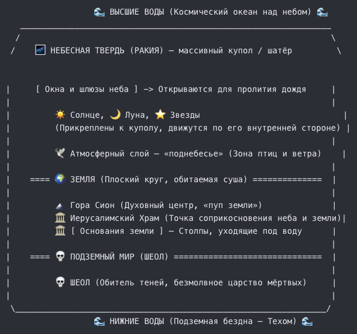
* Небесная твердь (Ракия): Небо представлялось твёрдым литым куполом, подобным хрусталю или кованому металлу. Бог «раскинул небеса, как шатёр» [1]. Выше этой тверди находятся Высшие воды — остатки первозданного океана творения. В тверди прорублены окна и шлюзы, которые Бог открывает, чтобы послать на землю благодатный дождь или разрушительный потоп.
* Светила: Солнце, Луна и звёзды не парят в пустоте, а зафиксированы на внутренней стороне купола Ракия. Они служат не божествами, а лишь механическими «светильниками» для отсчёта священных времён, дней и лет.
* Земной круг: Плоский диск суши, покоящийся на прочных Столпах земли (фундаменте). Столпы погружены глубоко в Нижние воды (Техом) — подземный пресноводный океан, питающий земные источники и колодцы. Центром земли считается гора Сион и Храм в Иерусалиме, через который молитвы людей поднимаются прямо к престолу Бога.
* Шеол: Мрачная подземная бездна, куда после смерти спускаются души абсолютно всех людей, независимо от их праведности. Это мир тишины, праха и забвения, где души («тени») ведут пассивное полусознательное существование. В библейскую эпоху концепция чёткого разделения на Рай и Ад ещё не была детально оформлена.

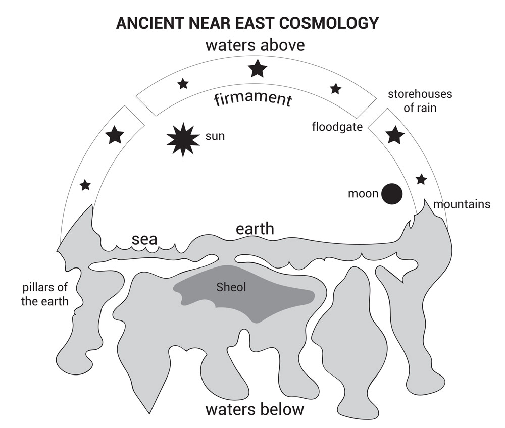
* Небесная твердь (Ракия): Небо представлялось твёрдым литым куполом, подобным хрусталю или кованому металлу. Бог «раскинул небеса, как шатёр» [1]. Выше этой тверди находятся Высшие воды — остатки первозданного океана творения. В тверди прорублены окна и шлюзы, которые Бог открывает, чтобы послать на землю благодатный дождь или разрушительный потоп.
* Светила: Солнце, Луна и звёзды не парят в пустоте, а зафиксированы на внутренней стороне купола Ракия. Они служат не божествами, а лишь механическими «светильниками» для отсчёта священных времён, дней и лет.
* Земной круг: Плоский диск суши, покоящийся на прочных Столпах земли (фундаменте). Столпы погружены глубоко в Нижние воды (Техом) — подземный пресноводный океан, питающий земные источники и колодцы. Центром земли считается гора Сион и Храм в Иерусалиме, через который молитвы людей поднимаются прямо к престолу Бога.
* Шеол: Мрачная подземная бездна, куда после смерти спускаются души абсолютно всех людей, независимо от их праведности. Это мир тишины, праха и забвения, где души («тени») ведут пассивное полусознательное существование. В библейскую эпоху концепция чёткого разделения на Рай и Ад ещё не была детально оформлена.

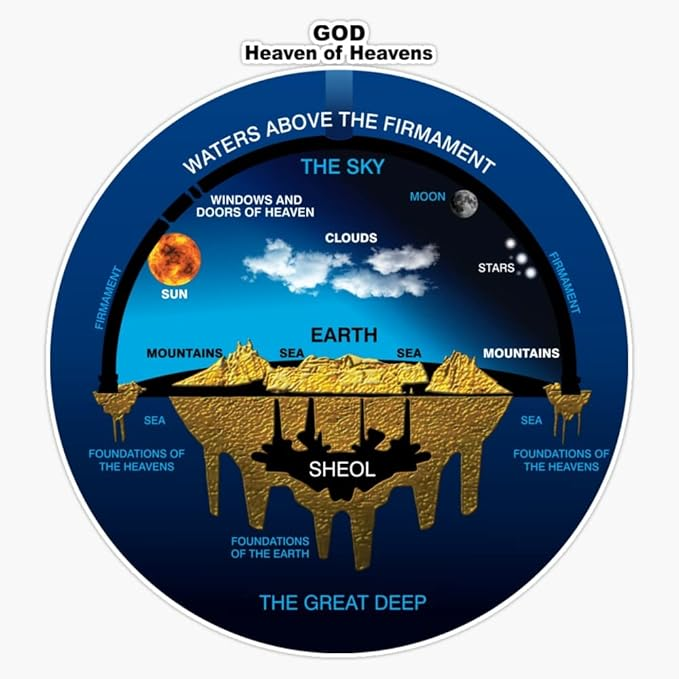
* Небесная твердь (Ракия): Небо представлялось твёрдым литым куполом, подобным хрусталю или кованому металлу. Бог «раскинул небеса, как шатёр» [1]. Выше этой тверди находятся Высшие воды — остатки первозданного океана творения. В тверди прорублены окна и шлюзы, которые Бог открывает, чтобы послать на землю благодатный дождь или разрушительный потоп.
* Светила: Солнце, Луна и звёзды не парят в пустоте, а зафиксированы на внутренней стороне купола Ракия. Они служат не божествами, а лишь механическими «светильниками» для отсчёта священных времён, дней и лет.
* Земной круг: Плоский диск суши, покоящийся на прочных Столпах земли (фундаменте). Столпы погружены глубоко в Нижние воды (Техом) — подземный пресноводный океан, питающий земные источники и колодцы. Центром земли считается гора Сион и Храм в Иерусалиме, через который молитвы людей поднимаются прямо к престолу Бога.
* Шеол: Мрачная подземная бездна, куда после смерти спускаются души абсолютно всех людей, независимо от их праведности. Это мир тишины, праха и забвения, где души («тени») ведут пассивное полусознательное существование. В библейскую эпоху концепция чёткого разделения на Рай и Ад ещё не была детально оформлена.

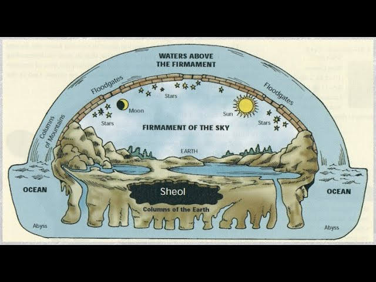
* Небесная твердь (Ракия): Небо представлялось твёрдым литым куполом, подобным хрусталю или кованому металлу. Бог «раскинул небеса, как шатёр» [1]. Выше этой тверди находятся Высшие воды — остатки первозданного океана творения. В тверди прорублены окна и шлюзы, которые Бог открывает, чтобы послать на землю благодатный дождь или разрушительный потоп.
* Светила: Солнце, Луна и звёзды не парят в пустоте, а зафиксированы на внутренней стороне купола Ракия. Они служат не божествами, а лишь механическими «светильниками» для отсчёта священных времён, дней и лет.
* Земной круг: Плоский диск суши, покоящийся на прочных Столпах земли (фундаменте). Столпы погружены глубоко в Нижние воды (Техом) — подземный пресноводный океан, питающий земные источники и колодцы. Центром земли считается гора Сион и Храм в Иерусалиме, через который молитвы людей поднимаются прямо к престолу Бога.
* Шеол: Мрачная подземная бездна, куда после смерти спускаются души абсолютно всех людей, независимо от их праведности. Это мир тишины, праха и забвения, где души («тени») ведут пассивное полусознательное существование. В библейскую эпоху концепция чёткого разделения на Рай и Ад ещё не была детально оформлена.

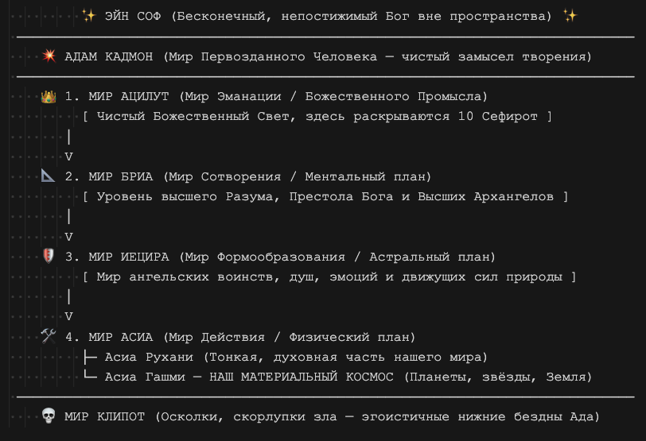
* Мир Ацилут (Мир Эманации): Высший из четырёх миров. Здесь нет разделения на субъекты, этот мир полностью состоит из Божественного Света. В Ацилуте этот свет структурируется в 10 Сефирот — качеств Бога (Мудрость, Милосердие, Справедливость и т.д.), которые управляют всеми нижними этажами Вселенной.
* Мир Бриа (Мир Сотворения): Уровень проявления высшего разума. В этом мире находится Престол Бога (Меркава) и обитают высшие ангелы (такие как Метатрон). Здесь Божественная энергия начинает обретать первые ментальные контуры, но ещё лишена плотной формы.
* Мир Иецира (Мир Формирования): Мир ангелов, которые служат механизмами управления законами природы. Каждое физическое явление (ветер, огонь, рост травы) имеет своего ангела в мире Иецира.
* Мир Асиа (Мир Действия): Самый нижний уровень. Он делится на духовную Асиа (где обитают человеческие души перед рождением) и физическую Асиа — это вся наша осязаемая Вселенная со всеми её галактиками, звёздами и планетами. Наш физический мир является «точкой максимального сокрытия Бога», где Божественный Свет почти незаметен, что даёт человеку свободу выбора между добром и злом.
* Клипот (Скорлупы): Тёмный мир, расположенный ниже Асиа. Когда Бог создавал мир, сосуды для принятия Его света не выдержали и разбились (катастрофа Швират ха-келим). Осколки этих сосудов упали на самое дно и образовали Клипот — мир эгоизма, духовной нечистоты и зла, который паразитирует на искрах Божественного Света, застрявших в осколках. Задача человека на Земле — совершать Тиккун (исправление мира), вызволяя эти искры добра своими праведными поступками.

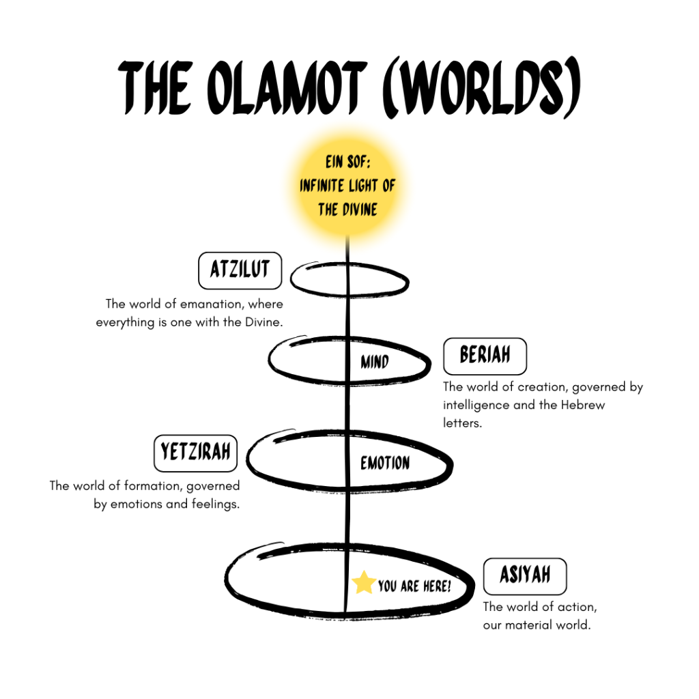
* Мир Ацилут (Мир Эманации): Высший из четырёх миров. Здесь нет разделения на субъекты, этот мир полностью состоит из Божественного Света. В Ацилуте этот свет структурируется в 10 Сефирот — качеств Бога (Мудрость, Милосердие, Справедливость и т.д.), которые управляют всеми нижними этажами Вселенной.
* Мир Бриа (Мир Сотворения): Уровень проявления высшего разума. В этом мире находится Престол Бога (Меркава) и обитают высшие ангелы (такие как Метатрон). Здесь Божественная энергия начинает обретать первые ментальные контуры, но ещё лишена плотной формы.
* Мир Иецира (Мир Формирования): Мир ангелов, которые служат механизмами управления законами природы. Каждое физическое явление (ветер, огонь, рост травы) имеет своего ангела в мире Иецира.
* Мир Асиа (Мир Действия): Самый нижний уровень. Он делится на духовную Асиа (где обитают человеческие души перед рождением) и физическую Асиа — это вся наша осязаемая Вселенная со всеми её галактиками, звёздами и планетами. Наш физический мир является «точкой максимального сокрытия Бога», где Божественный Свет почти незаметен, что даёт человеку свободу выбора между добром и злом.
* Клипот (Скорлупы): Тёмный мир, расположенный ниже Асиа. Когда Бог создавал мир, сосуды для принятия Его света не выдержали и разбились (катастрофа Швират ха-келим). Осколки этих сосудов упали на самое дно и образовали Клипот — мир эгоизма, духовной нечистоты и зла, который паразитирует на искрах Божественного Света, застрявших в осколках. Задача человека на Земле — совершать Тиккун (исправление мира), вызволяя эти искры добра своими праведными поступками.
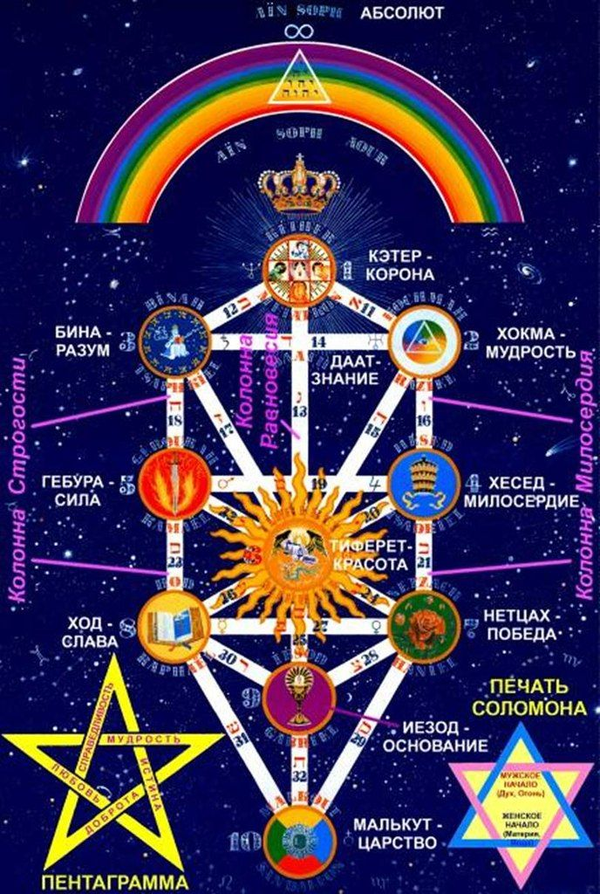
* Мир Ацилут (Мир Эманации): Высший из четырёх миров. Здесь нет разделения на субъекты, этот мир полностью состоит из Божественного Света. В Ацилуте этот свет структурируется в 10 Сефирот — качеств Бога (Мудрость, Милосердие, Справедливость и т.д.), которые управляют всеми нижними этажами Вселенной.
* Мир Бриа (Мир Сотворения): Уровень проявления высшего разума. В этом мире находится Престол Бога (Меркава) и обитают высшие ангелы (такие как Метатрон). Здесь Божественная энергия начинает обретать первые ментальные контуры, но ещё лишена плотной формы.
* Мир Иецира (Мир Формирования): Мир ангелов, которые служат механизмами управления законами природы. Каждое физическое явление (ветер, огонь, рост травы) имеет своего ангела в мире Иецира.
* Мир Асиа (Мир Действия): Самый нижний уровень. Он делится на духовную Асиа (где обитают человеческие души перед рождением) и физическую Асиа — это вся наша осязаемая Вселенная со всеми её галактиками, звёздами и планетами. Наш физический мир является «точкой максимального сокрытия Бога», где Божественный Свет почти незаметен, что даёт человеку свободу выбора между добром и злом.
* Клипот (Скорлупы): Тёмный мир, расположенный ниже Асиа. Когда Бог создавал мир, сосуды для принятия Его света не выдержали и разбились (катастрофа Швират ха-келим). Осколки этих сосудов упали на самое дно и образовали Клипот — мир эгоизма, духовной нечистоты и зла, который паразитирует на искрах Божественного Света, застрявших в осколках. Задача человека на Земле — совершать Тиккун (исправление мира), вызволяя эти искры добра своими праведными поступками.

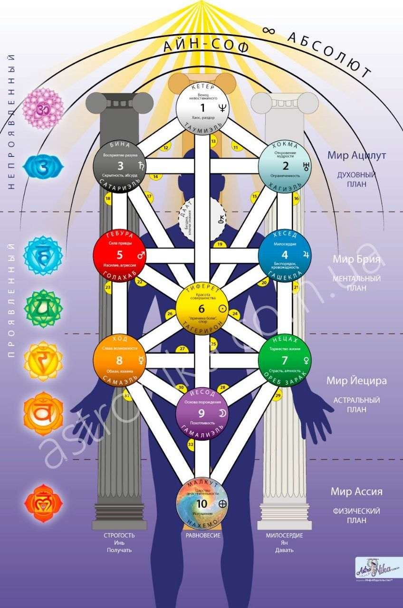
* Мир Ацилут (Мир Эманации): Высший из четырёх миров. Здесь нет разделения на субъекты, этот мир полностью состоит из Божественного Света. В Ацилуте этот свет структурируется в 10 Сефирот — качеств Бога (Мудрость, Милосердие, Справедливость и т.д.), которые управляют всеми нижними этажами Вселенной.
* Мир Бриа (Мир Сотворения): Уровень проявления высшего разума. В этом мире находится Престол Бога (Меркава) и обитают высшие ангелы (такие как Метатрон). Здесь Божественная энергия начинает обретать первые ментальные контуры, но ещё лишена плотной формы.
* Мир Иецира (Мир Формирования): Мир ангелов, которые служат механизмами управления законами природы. Каждое физическое явление (ветер, огонь, рост травы) имеет своего ангела в мире Иецира.
* Мир Асиа (Мир Действия): Самый нижний уровень. Он делится на духовную Асиа (где обитают человеческие души перед рождением) и физическую Асиа — это вся наша осязаемая Вселенная со всеми её галактиками, звёздами и планетами. Наш физический мир является «точкой максимального сокрытия Бога», где Божественный Свет почти незаметен, что даёт человеку свободу выбора между добром и злом.
* Клипот (Скорлупы): Тёмный мир, расположенный ниже Асиа. Когда Бог создавал мир, сосуды для принятия Его света не выдержали и разбились (катастрофа Швират ха-келим). Осколки этих сосудов упали на самое дно и образовали Клипот — мир эгоизма, духовной нечистоты и зла, который паразитирует на искрах Божественного Света, застрявших в осколках. Задача человека на Земле — совершать Тиккун (исправление мира), вызволяя эти искры добра своими праведными поступками.

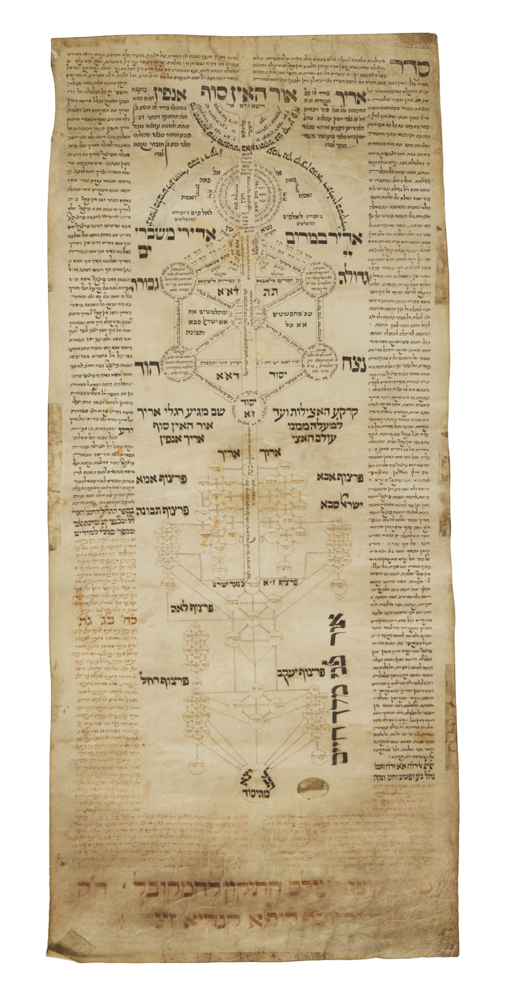
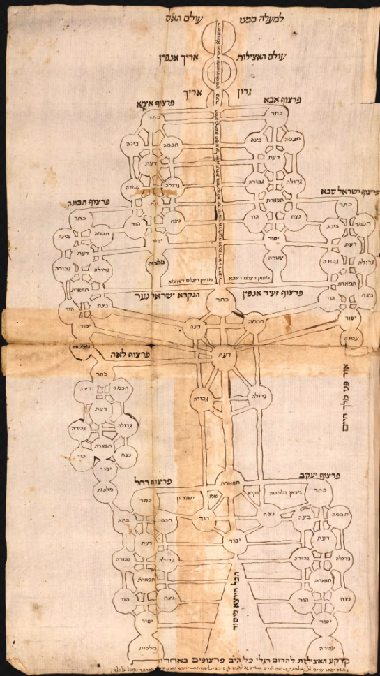

---

### title
*Христианская космология: от шатра до сфер*
### body
> Ранняя модель (Косьма Индикоплов, VI в.): Земля — прямоугольная равнина (ковчег), небо — шатёр на четырёх столбах. Поздняя схоластическая модель: аристотелевы сферы + Эмпирей (трон Бога) за сферой звёзд. Ад — в центре Земли.
### notes
*Модель Косьмы основана на библейском описании Скинии (походного храма).*
### search
Cosmas Indicopleustes Christian topography

---

### title
*Исламская космология: небесные сферы и ангелы*
### body
> Семь или девять небесных сфер — тонкие, прозрачные, вращаемые ангелами. Земля — сфера (аль-Бируни) или плоский диск. В некоторых версиях — Мировая гора Каф (изумрудная гора, окружающая всю землю). Светила встроены в сферы.
### notes
*Космологические схемы из рукописей аль-Казвини (XIII век) показывают ангелов, несущих небесные сферы.*
### search
Islamic medieval cosmology spheres angels Qazwini

---

### title
*Масонская космология: Вселенная как Храм*
### body
> Вселенная — творение Великого Архитектора. Космос имеет геометрическую структуру: окружность, центр, куб. Помещение ложи — модель мира (ориентация с востока на запад, потолок со звёздами). Солнце и Луна — «Великие Светила».
### notes
*Символы: циркуль (окружность, бесконечность), наугольник (материя, прямой путь). Три колонны: Мудрость, Сила, Красота.*
### search
Masonic square and compass cosmos lodge ceiling stars
### details
> Ложа ориентирована с востока на запад; на потолке — изображение звёздного неба. Циркуль и угольник символизируют духовное и материальное начало. Три колонны — Мудрость, Сила, Красота.
### article
Масонская космология рассматривает Вселенную как храм Великого Архитектора Вселенной. Геометрия (окружность, квадрат, куб) — ключ к пониманию порядка мира. Символика не отделена от ритуальной практики ложи.
### sources
- James Anderson, *The Constitutions of the Free-Masons* (1723)
- W. Kirk MacNulty, *The Way of the Craftsman* (2001)
### images

---

### title
*Чёрное Солнце как источник энергии внутри Земли*
### body
> Чёрное Солнце — источник пра-материи (Prima Materia), расположенный внутри Земли. Оно снабжает энергией подземный мир. Эта концепция описана в романе Эдварда Бульвер-Литтона «Грядущая раса» (1871) как «Врил» — энергия, получаемая от Чёрного Солнца.
### notes
*Модель пересекается с космологией Полой Земли (подземный мир, Агарта, Шамбала).*
### search
Black Sun Vril Bulwer-Lytton coming race interior earth

---

### title
*Ведическая космология: гора Меру и концентрические миры*
### body
> Вселенная — яйцо (Брахманда). В центре — гора Меру (космическая ось). Земля — плоский диск Джамбудвипа. Вокруг — концентрические океаны (солёный, сахарный, винный, гхи и др.) и кольцевые материки. Над Землёй — многослойные небеса (до 14 лок), под Землёй — слои ада. Солнце и Луна движутся по кругу вокруг горы Меру.
### notes
*Эта космология описывается в Пуранах (например, «Шримад-Бхагаватам») и в тексте «Сурья-сиддханта».*
### search
Mount Meru Vedic cosmology Jambudvipa concentric oceans

### article
В ведической философии (зафиксированной в Пуранах, Ведах и эпических текстах «Махабхарата» и «Рамаяна», «Шримад-Бхагаватам» и Упанишадах) наш обитаемый космос — это лишь одна из бесчисленных «икринок» в безграничном духовном океане. Это колоссальная по масштабам многомерная модель Вселенной. Ее ключевые отличия — колоссальные масштабы времени (циклы в миллиарды лет) и множественность обитаемых миров (лок), расположенных слоями вокруг осевой горы Меру.

## Подробное описание ведической концепции космоса
## 1. Высшая реальность: Духовное и Материальное разделение
Ведическая космология делит все сущее на две фундаментальные части в пропорции 3:1:

* Паравьёма (Духовное небо): Занимает 75% бытия. Это вечная, не созданная реальность, находящаяся вне времени. Она состоит из бесчисленных планет Вайкунтх, где нет смерти, старения и страданий. Живые существа здесь находятся в своих изначальных духовных телах.
* Махат-татва (Материальная природа): Занимает 25% бытия. Это временная, цикличная реальность, предназначенная для душ, пожелавших существовать независимо от Источника. Она отделена от Духовного неба Причинным океаном (Карана-водами).

## 2. Макрокосмос: Множественность Вселенных
Материальный мир не является единым пространством. Из пор тела гигантской космической формы Бога (Маха-Вишну), лежащего в Причинном океане, на его «выдохе» исходят миллиарды материальных «икринок» — Брахманд (Вселенных). На «вдохе» Маха-Вишну все Вселенные сворачиваются и исчезают обратно в его теле. Наша Вселенная — лишь одна из них, причем в ведических текстах она описывается как самая маленькая и незначительная по размеру.

## 3. Анатомия одной Вселенной (Брахманды)
Каждая Брахманда — это герметичное сферическое яйцо. Оно защищено от Причинного океана семью толстыми сферическими оболочками из базовых элементов (земля, вода, огонь, воздух, эфир, ложное эго, космический разум). Каждая внешняя оболочка в 10 раз толще предыдущей, что делает невозможным случайный выход за пределы своего космоса.
Внутри Брахманды пространство организовано следующим образом:

* Нижняя половина Вселенной: Полностью затоплена космической водой — океаном Гарбходака. На дне этого океана покоится тысячеглавый змей Шеша (Ананта), поддерживающий стабильность мира.
* Верхняя половина Вселенной: Пустое пространство, внутри которого выстроена 14-ярусная структура обитаемых миров (лок), напоминающая по форме космическое древо или тело исполинского человека (Пуруши).

## 4. Миры внутри нашей Вселенной: Сверху вниз
Четырнадцать планетных систем распределены по уровням сознания и преобладанию космических сил (гун):

* Миры Благости (Сатья, Тапо, Джана, Махар): Верхние этажи Вселенной. Здесь живут существа с чистым сознанием. На самом верху находится Сатья-лока — резиденция четырехголового бога-творца Брахмы, который управляет нашей конкретной Вселенной. Время здесь течет медленнее всего (один день Брахмы равен 4,32 млрд земных лет).
* Миры Страсти (Свар, Бхувар, Бху): Средний уровень. К нему относится Свар-лока (небесный рай материальных удовольствий Индры, где также закреплены звезды и планеты) и Бхувар-лока (тонкоматериальная атмосфера Земли). Основанием этого уровня служит Бху-лока — плоский гигантский диск Бху-манда, в центре которого зафиксирована золотая ось мира — гора Меру. Бху-лока уникальна: это «мир кармы» (в частности, область Бхарата-варша, где мы живем). Только здесь можно осознанно менять свою судьбу, духовно развиваться и выйти из сансары. Во всех остальных мирах существа лишь пассивно отрабатывают или «проедают» свою карму.
* Миры Подземного Наслаждения (Била-Сварга): Семь ярусов под диском Земли (от Аталы до Паталы). Это регионы невероятного технологического и материального комфорта, где в подземных дворцах живут змеи-наги и демоны-асуры. Они освещаются не солнцем, а гигантскими самоцветами. Здесь преобладает энергия невежества (тамас), так как живые существа полностью погружены в эгоизм и чувственные удовольствия, забыв о духовной природе.
* Миры Очищения (Нарака): Расположены на самом дне Брахманды, прямо над океаном Гарбходака. Это 28 временных адских бездн, где души под судом бога Ямараджа проходят суровое исправительное очищение от тяжелых грехов перед получением нового тела на Земле.

## Ключевая концепция: Пульсация Времени
Ведическое мироустройство полностью динамично. Вселенные не существуют вечно. Жизнь Брахмы длится 100 космических лет (311 триллионов земных лет). Каждые 4,32 миллиарда лет (Ночь Брахмы) нижние и средние миры (включая Землю) затапливаются и уничтожаются (частичная пралайя), а затем сотворяются заново. По истечении 100 лет Брахмы происходит Маха-пралайя — вся Брахманда со всеми своими 14 уровнями и защитными оболочками полностью растворяется, а материальные элементы возвращаются в непроявленное состояние до следующего выдоха Маха-Вишну.
Если вы хотите продолжить, мы можем разобрать, как ведическая космология объясняет механизм реинкарнации (как именно душа перемещается между этими 14 локами) или зафиксировать структуру 9 варш (регионов) на диске Бху-локи. Какой аспект уточнить?

## Архитектура трех миров (Трилока)
Космическое яйцо (Брахманда) разделено по вертикали на 14 основных планетных систем (лок), которые группируются в три глобальных яруса.
## 🌌 1. Высшие миры (Урдхва-лока) — 7 небес
Сферы возрастающей духовной чистоты и долголетия. Чем выше лока, тем тоньше материальные тела ее обитателей:

   1. Бху-лока: Поверхность земли (обитель людей и животных).
   2. Бхувар-лока: Пространство между землей и солнцем. Обитель сиддхов, гандхарвов (небесных музыкантов) и духов.
   3. Свар-лока (Сварга): Небесный рай во главе с богом Индрой. Сюда попадают праведники. Здесь же находятся орбиты Солнца, Луны, планет и Полярная звезда (Дхрувалока).
   4. Махар-лока: Обитель великих мудрецов-риши, которые живут миллиарды лет.
   5. Джана-лока: Место пребывания чистых сыновей Брахмы (Кумаров).
   6. Тапо-лока: Обитель аскетов и существ, полностью погруженных в медитацию.
   7. Сатья-лока (Брахмалока): Высшая сфера, обитель творца Брахмы. Жители этого мира не знают смерти и достигают полного освобождения.

## 🏔️ 2. Срединный мир (Бху-манда) — Земной диск
Представляется огромным плоским диском, имеющим сложную концентрическую структуру:

* Гора Меру: Гигантская золотая гора в форме перевернутого конуса, пронзающая все небесные сферы. Это ось Вселенной, на вершине которой расположены города главных богов (Брахмы, Шивы, Вишну).
* Семь материков и океанов: Вокруг Меру кольцами расположены 7 круглых материков (двип), разделенных 7 кольцевыми океанами из разных субстанций (соленая вода, сок сахарного тростника, вино, топленое масло, йогурт, молоко и пресная вода).
* Джамбудвипа и Бхарата-варша: Центральный материк называется Джамбудвипа. Его южная часть — Бхарата-варша (историческая Индия) — считается единственным местом во Вселенной («миром кармы»), где человек своими поступками может изменить свою будущую реинкарнацию; в остальных мирах существа лишь «проедают» накопленные заслуги или искупают грехи.

## 🐍 3. Подземные и адские миры (Патала-лока и Нарака) — 7 подземных ярусов
Вопреки стереотипам, Патала — это не ад, а регионы роскоши, скрытые от солнечного света, но освещаемые сиянием драгоценных камней:

* Патала (Атала, Витала, Сутала и др.): Семь подземных обитаемых ярусов. Здесь в подземных дворцах живут наги (мудрые полулюди-полузмеи), асуры (демоны) и дайтьи. Уровень комфорта и богатства здесь превосходит даже небесный рай Индры.
* Нарака: Расположена на самом дне Вселенной, ниже Паталы. Состоит из 28 темных бездн (кругов ада) под управлением бога смерти Ямы. Сюда души попадают временно для сурового очищения от грехов перед следующим земным воплощением.

## Опоры и внешние границы Вселенной

* Змей Шеша (Ананта-шеша): На самом дне космического яйца, в водах причинного океана, плавает тысячеглавый змей Шеша — воплощение вечности. На его головах, как на фундаменте, покоится весь земной диск Бху-манда со всеми его материками и горами.
* Космические слоны (Диггаджи): Непосредственно под диском земли стоят 4 (или 8) гигантских слона, которые поддерживают стороны света и подставляют свои спины, чтобы стабилизировать Землю от землетрясений. Землетрясение происходит, когда один из слонов устает и шевелит головой.
* Многослойная скорлупа: Брахманда изолирована от внешнего пространства семью толстыми концентрическими оболочками из базовых элементов материального мира (Земля, Вода, Огонь, Воздух, Эфир, Эгоизм, Космический разум). Каждая последующая оболочка в 10 раз толще предыдущей.

## Ключевая особенность: Цикличность и масштаб Времени
Индийский космос не статичен, он постоянно «дышит» и подчинен строгим временным циклам:

* День и Ночь Брахмы: Вселенная существует только в течение Дня Брахмы, который длится 4,32 миллиарда лет (одна Кальпа). Когда Брахма засыпает (наступает Ночь Брахмы аналогичной длины), низшие и средние миры уничтожаются огнем и водой (пралайя) и растворяются. Высшие небеса при этом сохраняются.
* Маха-пралайя: Полный жизненный цикл Брахмы длится 100 космических лет (311 триллионов человеческих лет). По истечении этого срока гибнет вся Брахманда целиком, включая высшие небеса. Затем из поры на теле Маха-Вишну рождается новый Брахма, и цикл творения запускается заново.

Если вы хотите продолжить, мы можем составить аналогичный подробный разбор для космологии древних Майя (с концепцией 13 небес, 9 подземных миров Шибальбы и космического древа Сейба) или перейти к древнеегипетским деталям. Какое направление выберем?

### images

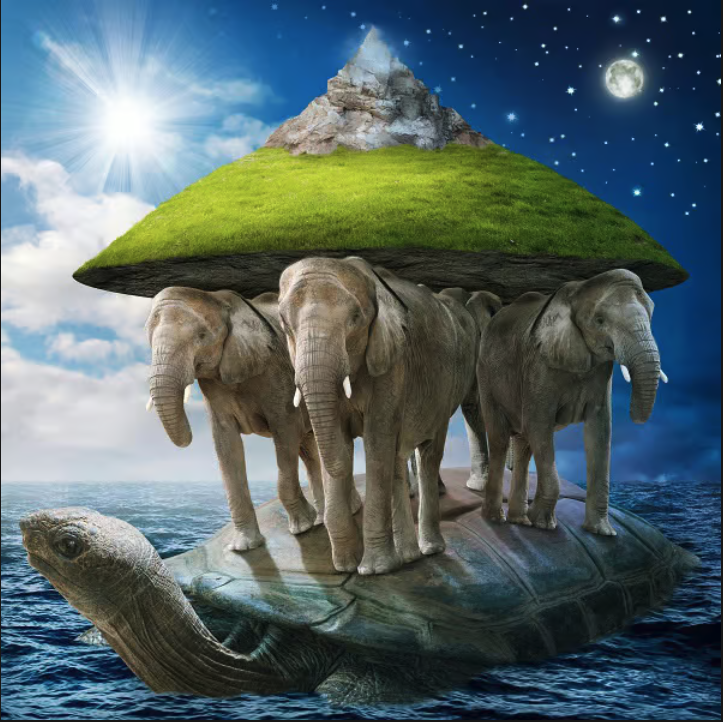
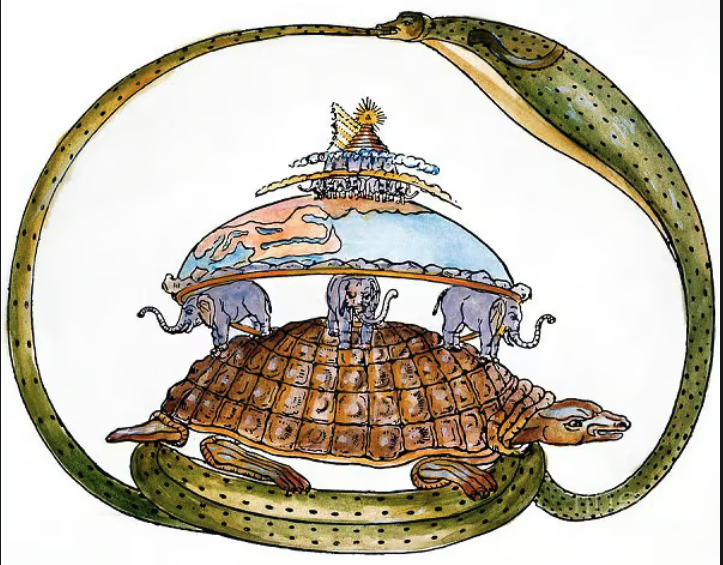
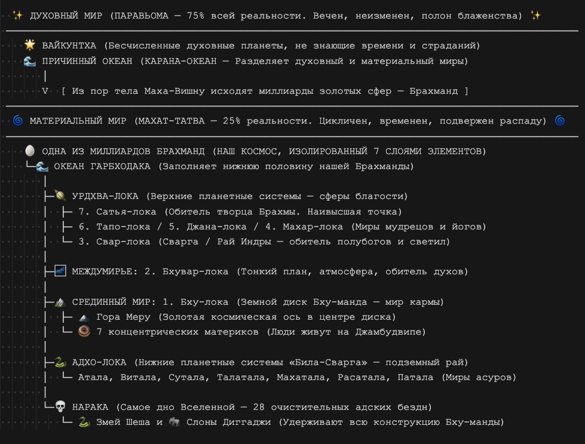
* Миры Благости (Сатья, Тапо, Джана, Махар): Верхние этажи Вселенной. Здесь живут существа с чистым сознанием. На самом верху находится Сатья-лока — резиденция четырехголового бога-творца Брахмы, который управляет нашей конкретной Вселенной. Время здесь течет медленнее всего (один день Брахмы равен 4,32 млрд земных лет).
* Миры Страсти (Свар, Бхувар, Бху): Средний уровень. К нему относится Свар-лока (небесный рай материальных удовольствий Индры, где также закреплены звезды и планеты) и Бхувар-лока (тонкоматериальная атмосфера Земли). Основанием этого уровня служит Бху-лока — плоский гигантский диск Бху-манда, в центре которого зафиксирована золотая ось мира — гора Меру. Бху-лока уникальна: это «мир кармы» (в частности, область Бхарата-варша, где мы живем). Только здесь можно осознанно менять свою судьбу, духовно развиваться и выйти из сансары. Во всех остальных мирах существа лишь пассивно отрабатывают или «проедают» свою карму.
* Миры Подземного Наслаждения (Била-Сварга): Семь ярусов под диском Земли (от Аталы до Паталы). Это регионы невероятного технологического и материального комфорта, где в подземных дворцах живут змеи-наги и демоны-асуры. Они освещаются не солнцем, а гигантскими самоцветами. Здесь преобладает энергия невежества (тамас), так как живые существа полностью погружены в эгоизм и чувственные удовольствия, забыв о духовной природе.
* Миры Очищения (Нарака): Расположены на самом дне Брахманды, прямо над океаном Гарбходака. Это 28 временных адских бездн, где души под судом бога Ямараджа проходят суровое исправительное очищение от тяжелых грехов перед получением нового тела на Земле.

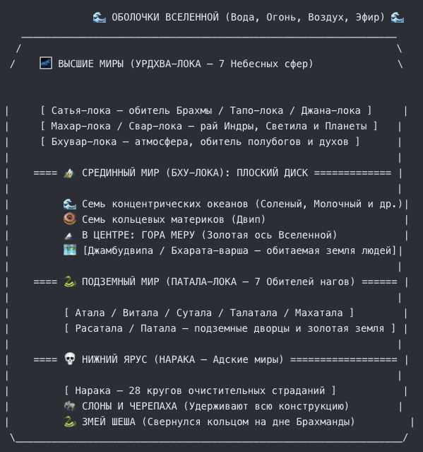
Космическое яйцо (Брахманда) разделено по вертикали на 14 основных планетных систем (лок), которые группируются в три глобальных яруса.
## 🌌 1. Высшие миры (Урдхва-лока) — 7 небес
Сферы возрастающей духовной чистоты и долголетия. Чем выше лока, тем тоньше материальные тела ее обитателей:

   1. Бху-лока: Поверхность земли (обитель людей и животных).
   2. Бхувар-лока: Пространство между землей и солнцем. Обитель сиддхов, гандхарвов (небесных музыкантов) и духов.
   3. Свар-лока (Сварга): Небесный рай во главе с богом Индрой. Сюда попадают праведники. Здесь же находятся орбиты Солнца, Луны, планет и Полярная звезда (Дхрувалока).
   4. Махар-лока: Обитель великих мудрецов-риши, которые живут миллиарды лет.
   5. Джана-лока: Место пребывания чистых сыновей Брахмы (Кумаров).
   6. Тапо-лока: Обитель аскетов и существ, полностью погруженных в медитацию.
   7. Сатья-лока (Брахмалока): Высшая сфера, обитель творца Брахмы. Жители этого мира не знают смерти и достигают полного освобождения.

## 🏔️ 2. Срединный мир (Бху-манда) — Земной диск
Представляется огромным плоским диском, имеющим сложную концентрическую структуру:

* Гора Меру: Гигантская золотая гора в форме перевернутого конуса, пронзающая все небесные сферы. Это ось Вселенной, на вершине которой расположены города главных богов (Брахмы, Шивы, Вишну).
* Семь материков и океанов: Вокруг Меру кольцами расположены 7 круглых материков (двип), разделенных 7 кольцевыми океанами из разных субстанций (соленая вода, сок сахарного тростника, вино, топленое масло, йогурт, молоко и пресная вода).
* Джамбудвипа и Бхарата-варша: Центральный материк называется Джамбудвипа. Его южная часть — Бхарата-варша (историческая Индия) — считается единственным местом во Вселенной («миром кармы»), где человек своими поступками может изменить свою будущую реинкарнацию; в остальных мирах существа лишь «проедают» накопленные заслуги или искупают грехи.

## 🐍 3. Подземные и адские миры (Патала-лока и Нарака) — 7 подземных ярусов
Вопреки стереотипам, Патала — это не ад, а регионы роскоши, скрытые от солнечного света, но освещаемые сиянием драгоценных камней:

* Патала (Атала, Витала, Сутала и др.): Семь подземных обитаемых ярусов. Здесь в подземных дворцах живут наги (мудрые полулюди-полузмеи), асуры (демоны) и дайтьи. Уровень комфорта и богатства здесь превосходит даже небесный рай Индры.
* Нарака: Расположена на самом дне Вселенной, ниже Паталы. Состоит из 28 темных бездн (кругов ада) под управлением бога смерти Ямы. Сюда души попадают временно для сурового очищения от грехов перед следующим земным воплощением.

## Опоры и внешние границы Вселенной

* Змей Шеша (Ананта-шеша): На самом дне космического яйца, в водах причинного океана, плавает тысячеглавый змей Шеша — воплощение вечности. На его головах, как на фундаменте, покоится весь земной диск Бху-манда со всеми его материками и горами.
* Космические слоны (Диггаджи): Непосредственно под диском земли стоят 4 (или 8) гигантских слона, которые поддерживают стороны света и подставляют свои спины, чтобы стабилизировать Землю от землетрясений. Землетрясение происходит, когда один из слонов устает и шевелит головой.
* Многослойная скорлупа: Брахманда изолирована от внешнего пространства семью толстыми концентрическими оболочками из базовых элементов материального мира (Земля, Вода, Огонь, Воздух, Эфир, Эгоизм, Космический разум). Каждая последующая оболочка в 10 раз толще предыдущей.

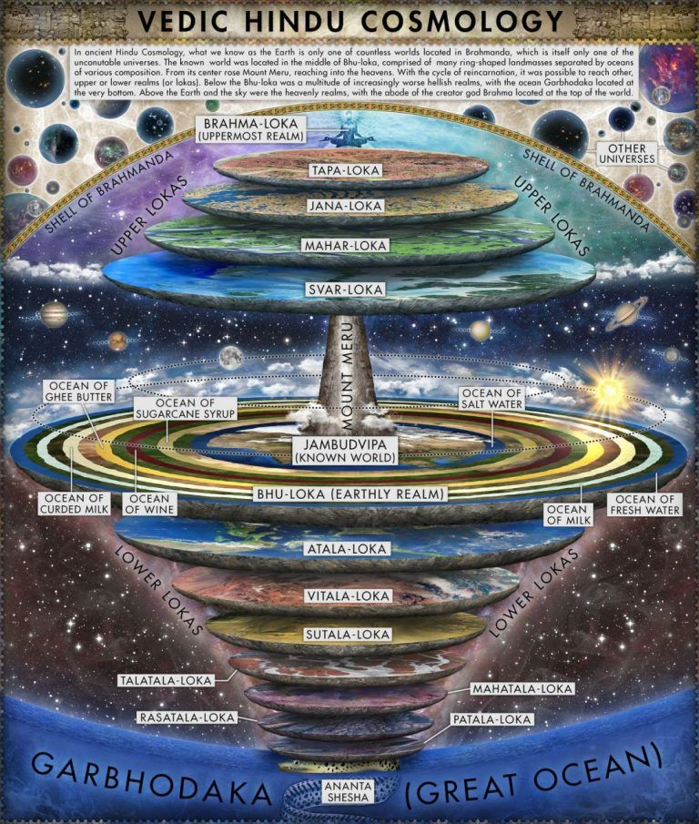
## 3. Анатомия одной Вселенной (Брахманды)
Каждая Брахманда — это герметичное сферическое яйцо. Оно защищено от Причинного океана семью толстыми сферическими оболочками из базовых элементов (земля, вода, огонь, воздух, эфир, ложное эго, космический разум). Каждая внешняя оболочка в 10 раз толще предыдущей, что делает невозможным случайный выход за пределы своего космоса.
Внутри Брахманды пространство организовано следующим образом:

* Нижняя половина Вселенной: Полностью затоплена космической водой — океаном Гарбходака. На дне этого океана покоится тысячеглавый змей Шеша (Ананта), поддерживающий стабильность мира.
* Верхняя половина Вселенной: Пустое пространство, внутри которого выстроена 14-ярусная структура обитаемых миров (лок), напоминающая по форме космическое древо или тело исполинского человека (Пуруши).

## 4. Миры внутри нашей Вселенной: Сверху вниз
Четырнадцать планетных систем распределены по уровням сознания и преобладанию космических сил (гун):

* Миры Благости (Сатья, Тапо, Джана, Махар): Верхние этажи Вселенной. Здесь живут существа с чистым сознанием. На самом верху находится Сатья-лока — резиденция четырехголового бога-творца Брахмы, который управляет нашей конкретной Вселенной. Время здесь течет медленнее всего (один день Брахмы равен 4,32 млрд земных лет).
* Миры Страсти (Свар, Бхувар, Бху): Средний уровень. К нему относится Свар-лока (небесный рай материальных удовольствий Индры, где также закреплены звезды и планеты) и Бхувар-лока (тонкоматериальная атмосфера Земли). Основанием этого уровня служит Бху-лока — плоский гигантский диск Бху-манда, в центре которого зафиксирована золотая ось мира — гора Меру. Бху-лока уникальна: это «мир кармы» (в частности, область Бхарата-варша, где мы живем). Только здесь можно осознанно менять свою судьбу, духовно развиваться и выйти из сансары. Во всех остальных мирах существа лишь пассивно отрабатывают или «проедают» свою карму.
* Миры Подземного Наслаждения (Била-Сварга): Семь ярусов под диском Земли (от Аталы до Паталы). Это регионы невероятного технологического и материального комфорта, где в подземных дворцах живут змеи-наги и демоны-асуры. Они освещаются не солнцем, а гигантскими самоцветами. Здесь преобладает энергия невежества (тамас), так как живые существа полностью погружены в эгоизм и чувственные удовольствия, забыв о духовной природе.
* Миры Очищения (Нарака): Расположены на самом дне Брахманды, прямо над океаном Гарбходака. Это 28 временных адских бездн, где души под судом бога Ямараджа проходят суровое исправительное очищение от тяжелых грехов перед получением нового тела на Земле.
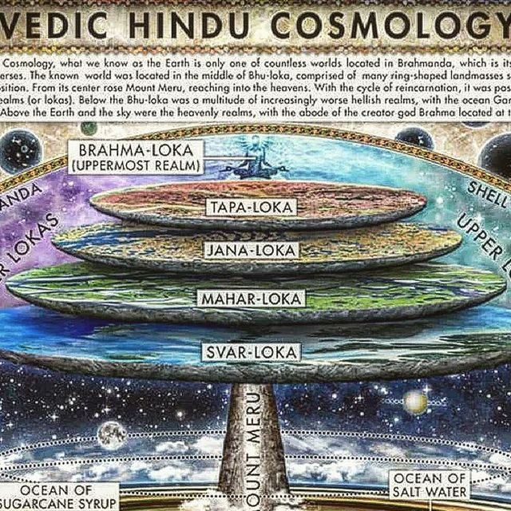
## 3. Анатомия одной Вселенной (Брахманды)
Каждая Брахманда — это герметичное сферическое яйцо. Оно защищено от Причинного океана семью толстыми сферическими оболочками из базовых элементов (земля, вода, огонь, воздух, эфир, ложное эго, космический разум). Каждая внешняя оболочка в 10 раз толще предыдущей, что делает невозможным случайный выход за пределы своего космоса.
Внутри Брахманды пространство организовано следующим образом:

* Нижняя половина Вселенной: Полностью затоплена космической водой — океаном Гарбходака. На дне этого океана покоится тысячеглавый змей Шеша (Ананта), поддерживающий стабильность мира.
* Верхняя половина Вселенной: Пустое пространство, внутри которого выстроена 14-ярусная структура обитаемых миров (лок), напоминающая по форме космическое древо или тело исполинского человека (Пуруши).

## 4. Миры внутри нашей Вселенной: Сверху вниз
Четырнадцать планетных систем распределены по уровням сознания и преобладанию космических сил (гун):

* Миры Благости (Сатья, Тапо, Джана, Махар): Верхние этажи Вселенной. Здесь живут существа с чистым сознанием. На самом верху находится Сатья-лока — резиденция четырехголового бога-творца Брахмы, который управляет нашей конкретной Вселенной. Время здесь течет медленнее всего (один день Брахмы равен 4,32 млрд земных лет).
* Миры Страсти (Свар, Бхувар, Бху): Средний уровень. К нему относится Свар-лока (небесный рай материальных удовольствий Индры, где также закреплены звезды и планеты) и Бхувар-лока (тонкоматериальная атмосфера Земли). Основанием этого уровня служит Бху-лока — плоский гигантский диск Бху-манда, в центре которого зафиксирована золотая ось мира — гора Меру. Бху-лока уникальна: это «мир кармы» (в частности, область Бхарата-варша, где мы живем). Только здесь можно осознанно менять свою судьбу, духовно развиваться и выйти из сансары. Во всех остальных мирах существа лишь пассивно отрабатывают или «проедают» свою карму.
* Миры Подземного Наслаждения (Била-Сварга): Семь ярусов под диском Земли (от Аталы до Паталы). Это регионы невероятного технологического и материального комфорта, где в подземных дворцах живут змеи-наги и демоны-асуры. Они освещаются не солнцем, а гигантскими самоцветами. Здесь преобладает энергия невежества (тамас), так как живые существа полностью погружены в эгоизм и чувственные удовольствия, забыв о духовной природе.
* Миры Очищения (Нарака): Расположены на самом дне Брахманды, прямо над океаном Гарбходака. Это 28 временных адских бездн, где души под судом бога Ямараджа проходят суровое исправительное очищение от тяжелых грехов перед получением нового тела на Земле.
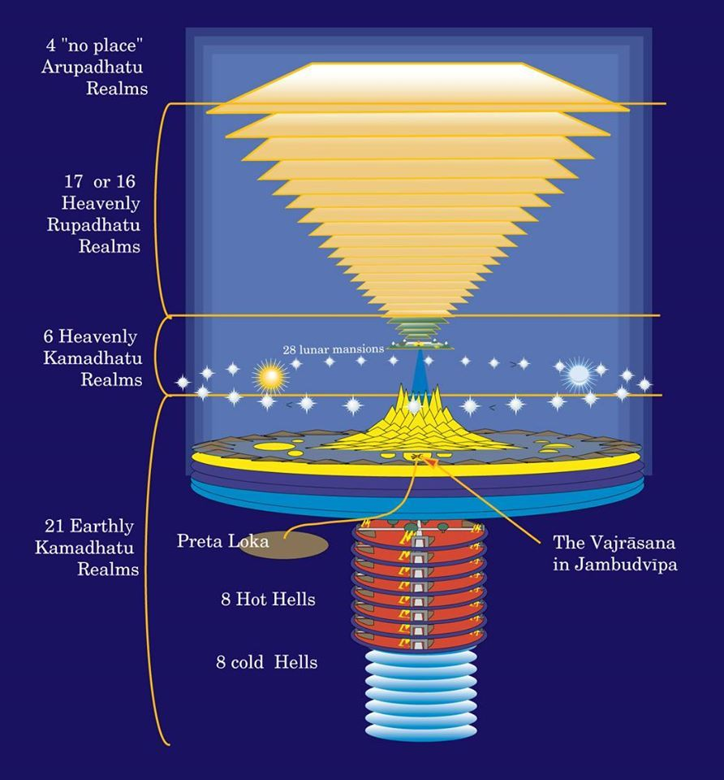
## 3. Анатомия одной Вселенной (Брахманды)
Каждая Брахманда — это герметичное сферическое яйцо. Оно защищено от Причинного океана семью толстыми сферическими оболочками из базовых элементов (земля, вода, огонь, воздух, эфир, ложное эго, космический разум). Каждая внешняя оболочка в 10 раз толще предыдущей, что делает невозможным случайный выход за пределы своего космоса.
Внутри Брахманды пространство организовано следующим образом:

* Нижняя половина Вселенной: Полностью затоплена космической водой — океаном Гарбходака. На дне этого океана покоится тысячеглавый змей Шеша (Ананта), поддерживающий стабильность мира.
* Верхняя половина Вселенной: Пустое пространство, внутри которого выстроена 14-ярусная структура обитаемых миров (лок), напоминающая по форме космическое древо или тело исполинского человека (Пуруши).

## 4. Миры внутри нашей Вселенной: Сверху вниз
Четырнадцать планетных систем распределены по уровням сознания и преобладанию космических сил (гун):

* Миры Благости (Сатья, Тапо, Джана, Махар): Верхние этажи Вселенной. Здесь живут существа с чистым сознанием. На самом верху находится Сатья-лока — резиденция четырехголового бога-творца Брахмы, который управляет нашей конкретной Вселенной. Время здесь течет медленнее всего (один день Брахмы равен 4,32 млрд земных лет).
* Миры Страсти (Свар, Бхувар, Бху): Средний уровень. К нему относится Свар-лока (небесный рай материальных удовольствий Индры, где также закреплены звезды и планеты) и Бхувар-лока (тонкоматериальная атмосфера Земли). Основанием этого уровня служит Бху-лока — плоский гигантский диск Бху-манда, в центре которого зафиксирована золотая ось мира — гора Меру. Бху-лока уникальна: это «мир кармы» (в частности, область Бхарата-варша, где мы живем). Только здесь можно осознанно менять свою судьбу, духовно развиваться и выйти из сансары. Во всех остальных мирах существа лишь пассивно отрабатывают или «проедают» свою карму.
* Миры Подземного Наслаждения (Била-Сварга): Семь ярусов под диском Земли (от Аталы до Паталы). Это регионы невероятного технологического и материального комфорта, где в подземных дворцах живут змеи-наги и демоны-асуры. Они освещаются не солнцем, а гигантскими самоцветами. Здесь преобладает энергия невежества (тамас), так как живые существа полностью погружены в эгоизм и чувственные удовольствия, забыв о духовной природе.
* Миры Очищения (Нарака): Расположены на самом дне Брахманды, прямо над океаном Гарбходака. Это 28 временных адских бездн, где души под судом бога Ямараджа проходят суровое исправительное очищение от тяжелых грехов перед получением нового тела на Земле.
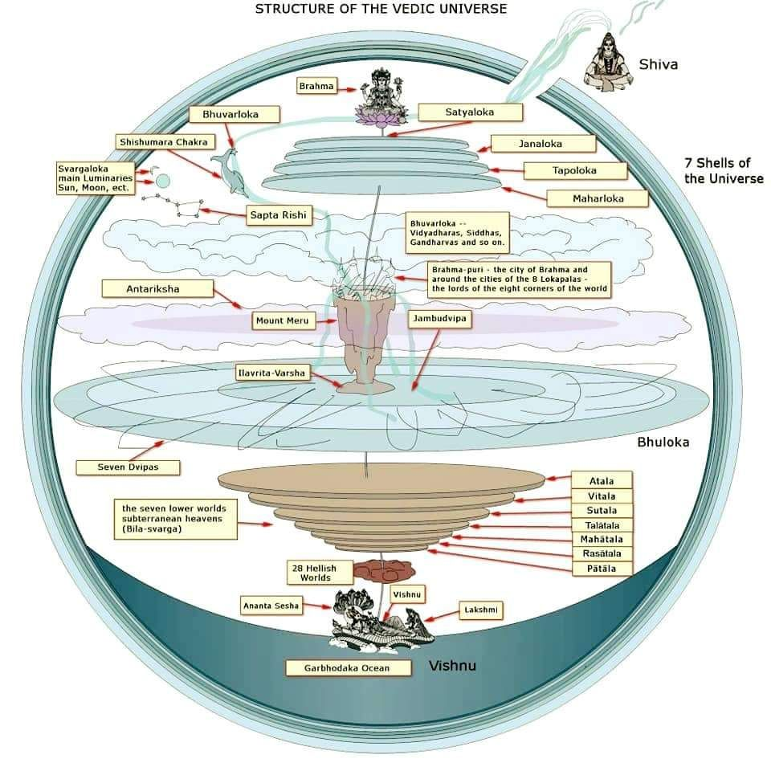
## 3. Анатомия одной Вселенной (Брахманды)
Каждая Брахманда — это герметичное сферическое яйцо. Оно защищено от Причинного океана семью толстыми сферическими оболочками из базовых элементов (земля, вода, огонь, воздух, эфир, ложное эго, космический разум). Каждая внешняя оболочка в 10 раз толще предыдущей, что делает невозможным случайный выход за пределы своего космоса.
Внутри Брахманды пространство организовано следующим образом:

* Нижняя половина Вселенной: Полностью затоплена космической водой — океаном Гарбходака. На дне этого океана покоится тысячеглавый змей Шеша (Ананта), поддерживающий стабильность мира.
* Верхняя половина Вселенной: Пустое пространство, внутри которого выстроена 14-ярусная структура обитаемых миров (лок), напоминающая по форме космическое древо или тело исполинского человека (Пуруши).

## 4. Миры внутри нашей Вселенной: Сверху вниз
Четырнадцать планетных систем распределены по уровням сознания и преобладанию космических сил (гун):

* Миры Благости (Сатья, Тапо, Джана, Махар): Верхние этажи Вселенной. Здесь живут существа с чистым сознанием. На самом верху находится Сатья-лока — резиденция четырехголового бога-творца Брахмы, который управляет нашей конкретной Вселенной. Время здесь течет медленнее всего (один день Брахмы равен 4,32 млрд земных лет).
* Миры Страсти (Свар, Бхувар, Бху): Средний уровень. К нему относится Свар-лока (небесный рай материальных удовольствий Индры, где также закреплены звезды и планеты) и Бхувар-лока (тонкоматериальная атмосфера Земли). Основанием этого уровня служит Бху-лока — плоский гигантский диск Бху-манда, в центре которого зафиксирована золотая ось мира — гора Меру. Бху-лока уникальна: это «мир кармы» (в частности, область Бхарата-варша, где мы живем). Только здесь можно осознанно менять свою судьбу, духовно развиваться и выйти из сансары. Во всех остальных мирах существа лишь пассивно отрабатывают или «проедают» свою карму.
* Миры Подземного Наслаждения (Била-Сварга): Семь ярусов под диском Земли (от Аталы до Паталы). Это регионы невероятного технологического и материального комфорта, где в подземных дворцах живут змеи-наги и демоны-асуры. Они освещаются не солнцем, а гигантскими самоцветами. Здесь преобладает энергия невежества (тамас), так как живые существа полностью погружены в эгоизм и чувственные удовольствия, забыв о духовной природе.
* Миры Очищения (Нарака): Расположены на самом дне Брахманды, прямо над океаном Гарбходака. Это 28 временных адских бездн, где души под судом бога Ямараджа проходят суровое исправительное очищение от тяжелых грехов перед получением нового тела на Земле.
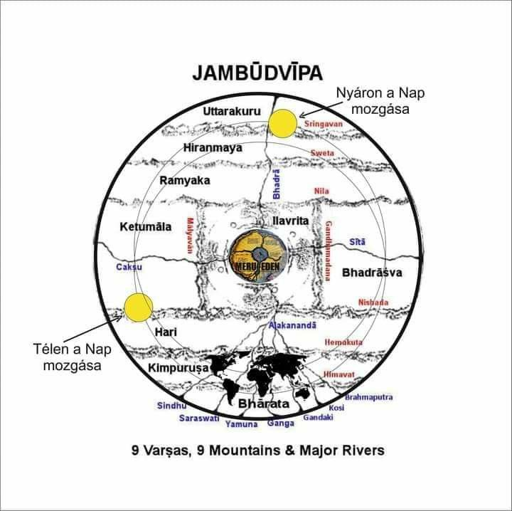

---

### title
*Полая Земля и Вогнутая Земля: две модели полой сферы*
### body
> **Полая Земля (Hollow Earth):** Земля — сфера с внутренней полостью. Люди живут на внешней поверхности. Внутри — пространство с атмосферой, солнце в центре. Входы — на Северном и Южном полюсах (Галлей, 1692; Симмс, 1818).
>
> **Вогнутая Земля (Concave Earth):** Земля — полая сфера. Люди живут на внутренней поверхности. Солнце, Луна и звёзды находятся внутри сферы. То, что мы видим как небо — противоположная сторона Земли (Сайрус Рид Тид, 1898).
### notes
*Различие: в «Полой Земле» люди снаружи (обычное восприятие), в «Вогнутой Земле» — внутри (вся вселенная внутри Земли).*
### search
Hollow Earth cross section Symmes hole` и `Concave Earth Koresh diagram

---

### title
*Сотовая Земля (Cellular Earth): множество миров-ячеек*
### body
> Пространство организовано как множество ячеек (сот). Каждая сота — самостоятельный мир со своей поверхностью, атмосферой и солнцем. Наша Земля — одна из ячеек. Между сотами — барьеры (ледяные, энергетические, невидимые). В разных сотах могут действовать разные физические законы.
### notes
*Идея известна с XIX века, распространилась в интернете в XXI веке. Не путать с книгой Тида «Cellular Cosmogony» (это модель Вогнутой Земли).*
### search
cellular earth honeycomb worlds diagram

---

### title
*Terra Infinita (Бесконечная Земля)*
### body
> Земля — бесконечная плоскость, разделённая на ячейки. Наша Земля — одна из ячеек. В соседней ячейке находится «Вторая Земля» — мир, похожий на наш, но большего размера. Это картографическая версия идеи сотового устройства. Ячейки отделены друг от друга барьерами.
### notes
*Известна по цветным картам, распространяемым в интернете с 2010-х годов. Карта показывает подписанные ячейки.*
### search
Terra Infinita map infinite flat earth cells

---

### title
*Современная плоская Земля: геоцентрическая модель*
### body
> Земля — плоский диск (Арктика в центре, Антарктида — ледяная стена по краю). Солнце и Луна — небольшие светила (~50 км), движущиеся по кругу над плоскостью Земли (как прожекторы). Звёзды — на твёрдом куполе. Гравитация заменена ускорением диска вверх (~9.8 м/с²). Вся вселенная вращается вокруг Земли.
### notes
*Основатель современной модели — Сэмюэл Роуботэм (книга «Zetetic Astronomy», 1865). Широкое распространение получила в интернете с 2000-х годов.*
### search
modern flat earth azimuthal map sun path

---

### title
*Конец*
### body
> *Космологические модели разных культур и традиций*
### notes
*Никакого анализа или выводов. Просто завершение презентации.*
### search
starfield background dark
